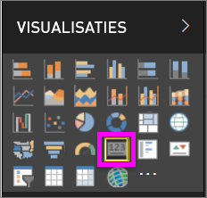
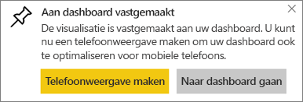
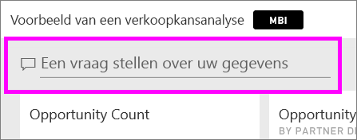
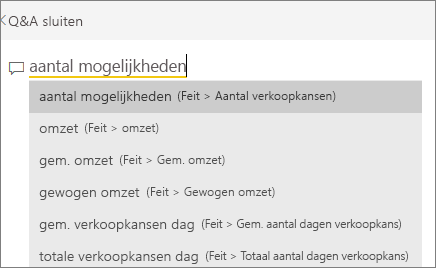
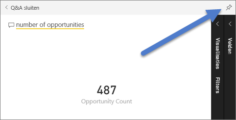
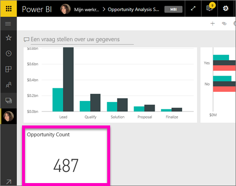
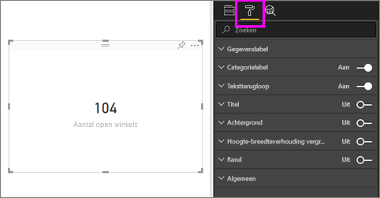
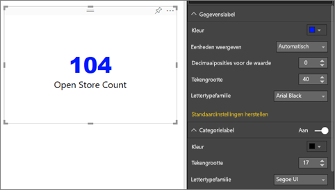
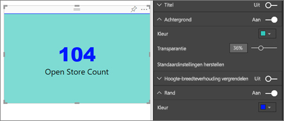

# Kaartvisualisaties
Soms is één getal het belangrijkste dat u wilt bijhouden op uw Power BI-dashboard of -rapport, zoals de totale omzet, het marktaandeel jaar na jaar of het totale aantal verkoopkansen. Dit type visualisatie wordt een *kaart* genoemd. Net als bij bijna alle systeemeigen Power BI-visualisaties kunnen kaarten worden gemaakt met behulp van de rapporteditor of Q&A.

## Een kaart maken met behulp van de rapporteditor
In deze instructies wordt het voorbeeld van een retailanalyse gebruikt. Om mee te lezen kunt u het [voorbeeld downloaden](../sample-datasets.md) voor de Power BI-service (app.powerbi.com) of voor Power BI Desktop.   

1. Start op een lege rapportpagina en selecteer het veld **Winkel** \> **Aantal open winkels**. Als u de Power BI-service gebruikt, moet u het rapport openen in de [bewerkweergave](../service-interact-with-a-report-in-editing-view.md).

    Power BI maakt een kolomdiagram met één getal.

   
2. Selecteer het kaartpictogram in het deelvenster Visualisaties.

   
6. Beweeg de muisaanwijzer over de kaart en selecteer het speldpictogram  om de visualisatie toe te voegen aan het dashboard.

   
7. Maak de tegel vast aan een bestaand dashboard of aan een nieuw dashboard.

   * Bestaand dashboard: selecteer de naam van het dashboard in de vervolgkeuzelijst.
   * Nieuw dashboard: typ de naam van het nieuwe dashboard.
8. Selecteer **Vastmaken**.

   U ontvangt een bericht (in de rechterbovenhoek) dat de visualisatie als tegel aan uw dashboard is toegevoegd.

   
9. Selecteer **Naar het dashboard gaan**. Daar kunt u de vastgemaakte visualisatie [bewerken en verplaatsen](../service-dashboard-edit-tile.md).

## Een kaart maken via het vak Q&A
Het vak Q&A is de eenvoudigste manier om een kaart te maken. Het vak Q&A is beschikbaar in de Power BI service (app.powerbi.com) vanuit een dashboard of een rapport en in Desktop-rapportweergave. De onderstaande stappen beschrijven het maken van een kaart via een dashboard in de Power BI-service. Als u met behulp van Q&A een kaart wilt maken in Power BI Desktop, [volgt u deze instructies](https://powerbi.microsoft.com/blog/power-bi-desktop-december-feature-summary/#QandA) voor de Q&A-preview voor Desktop-rapporten.

1. Maak een [dashboard](../service-dashboards.md) en [haal gegevens op](../service-get-data.md). In dit voorbeeld gebruiken we het [Voorbeeld van een kansanalyse](../sample-opportunity-analysis.md).

1. Typ in het vak Vraag aan de bovenkant van het dashboard wat u wilt weten over uw gegevens. 

   

> [!TIP]
> Selecteer vanuit een Power BI-servicerapport in de bewerkweergave de optie **Een vraag stellen** in de menubalk aan de bovenkant. Zoek vanuit een Power BI Desktop-rapport naar een open ruimte in een rapport en dubbelklik hierop om een vraagvak te openen.

3. Typ bijvoorbeeld 'aantal kansen' in het vak Vraag.

   

   In het vraagvak vindt u suggesties en verklaringen en ten slotte het totale aantal.  
4. Selecteer het speldpictogram  in de rechterbovenhoek om de kaart toe te voegen aan een dashboard.

   
5. Maak de kaart als een tegel vast aan een bestaand dashboard of aan een nieuw dashboard.

   * Bestaand dashboard: selecteer de naam van het dashboard in de vervolgkeuzelijst. Uw keuzes zijn beperkt tot alleen de dashboards in de huidige werkruimte.
   * Nieuw dashboard: typ de naam van het nieuwe dashboard en het wordt toegevoegd aan uw huidige werkruimte.
6. Selecteer **Vastmaken**.

   U ontvangt een bericht (in de rechterbovenhoek) dat de visualisatie als tegel aan uw dashboard is toegevoegd.  

   
7. Selecteer **Naar dashboard gaan** om de nieuwe tegel te zien. Daar kunt u de tegel [een andere naam geven, vergroten of verkleinen, er een hyperlink aan toevoegen, de tegel verplaatsen en meer](../service-dashboard-edit-tile.md) op uw dashboard.

   

## Aandachtspunten en probleemoplossing
- Als u het vak Vraag niet wordt weergegeven, neemt u contact op met de beheerder van uw systeem of tenant.    
- Als u Desktop gebruikt en op een lege ruimte in een rapport dubbelklikt maar Q&A niet wordt geopend, moet u deze functie mogelijk eerst inschakelen.  Selecteer **Bestand > Opties en instellingen > Opties > Preview-functies > Q&A** en start Desktop opnieuw op.

## Een kaart opmaken
U hebt vele opties om de labels, tekst, kleur en meer te wijzigen. De beste manier om dit te leren is door een kaart te maken en naar het opmaakvenster te gaan. Hieronder volgt een aantal beschikbare indelingsopties. 

1. Open het opmaakvenster door de verfroller te selecteren. 

    
2. Vouw **Gegevenslabel** uit en wijzig de kleur, grootte en de lettertypefamilie. Stel, u hebt duizenden winkels. Dan kunt u **Eenheden weergeven** gebruiken om het aantal winkels per duizendtallen weer te geven en de decimaalposities in te stellen. U kunt bijvoorbeeld 125,8K weergeven in plaats van 125.832,00.

3.  Vouw **Gegevenslabel** uit en wijzig de kleur en grootte.

    

4. Vouw **Achtergrond** uit en verplaats de schuifregelaar naar Aan.  U kunt vervolgens de achtergrondkleur en de transparantie instellen.

    

5. Probeer de andere opmaakopties om uw kaart geheel naar wens te maken. 

    

## Volgende stappen
[Combinatiegrafieken in Power BI](power-bi-visualization-combo-chart.md)

[Visualization types in Power BI](power-bi-visualization-types-for-reports-and-q-and-a.md) (Typen visualisaties in Power BI)
