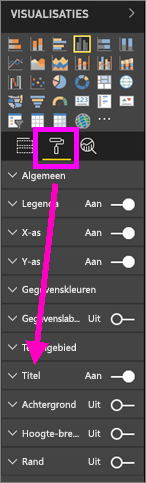
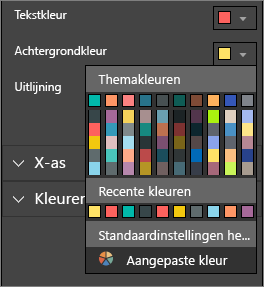
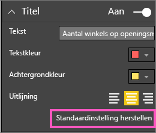
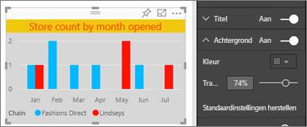
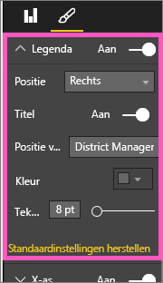
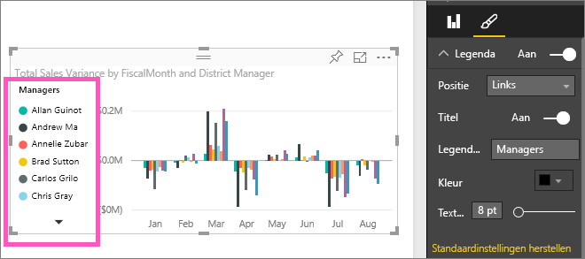

# Titels, legenda's en achtergronden van visualisaties aanpassen
In deze zelfstudie leert u een aantal verschillende manieren kennen om uw visualisaties aan te passen.   Er zijn heel veel opties voor het aanpassen van uw visualisaties. De beste manier om ze te leren kennen is door het deelvenster Opmaak te verkennen (selecteer de verfroller).  Dit artikel helpt u op weg door te laten zien hoe u de titel, legenda en achtergrond van een visualisatie kunt aanpassen.  

Niet alle visualisaties kunnen worden aangepast. [Bekijk de volledige lijst](#list).  

Kijk hoe Amanda visualisaties in haar rapport aanpast (spoel vooruit naar 4:50 in de video). Volg vervolgens de instructies onder de video om het zelf te proberen met uw eigen gegevens.

<iframe width="560" height="315" src="https://www.youtube.com/embed/IkJda4O7oGs" frameborder="0" allowfullscreen></iframe>

### Vereisten
- Power BI-service of Power BI Desktop
- Voorbeeld van een retailanalyse

## Visualisatietitels in rapporten aanpassen
Als u mee wilt doen, meld u zich aan bij de Power BI-service (app.powerbi.com) en [opent u het rapport Voorbeeld van een retailanalyse](../sample-datasets.md) in de [bewerkingsweergave](../service-interact-with-a-report-in-editing-view.md).

> [!NOTE]
> Wanneer u een visualisatie aan een dashboard vastmaakt, wordt deze dashboardtegel.  De tegels zelf kunnen ook worden aangepast met [nieuwe titels, ondertitels en hyperlinks, en het formaat ervan kan worden gewijzigd](../service-dashboard-edit-tile.md).
> 
> 

1. Navigeer naar de pagina ‘New Stores’ (Nieuwe winkels) van het rapport en selecteer het kolomdiagram ‘Open Store Count by Open Month...’ (Aantal geopende winkels per openingsmaand...).
2. Selecteer het verfrollerpictogram in het deelvenster Visualisaties om de opmaakopties zichtbaar te maken.  en selecteer **Titel** om die sectie uit te vouwen.  

   
3. Schakel **Titel** in of uit door de schuifknop Aan (of Uit) te selecteren. Laat deze voorlopig **Aan** staan.  

   
4. Wijziging de **Titeltekst** door in het tekstveld **Aantal geopende winkels per openingsmaand** te typen.  
5. Wijzig de **Tekstkleur** in oranje en de **Achtergrondkleur** in geel.

   * Selecteer de vervolgkeuzelijst en kies een kleur uit de **Themakleuren**, **Recente kleuren**, of **Aangepaste kleur**.
   * Selecteer de vervolgkeuzelijst om het kleurvenster te sluiten.  
     

   U kunt altijd de standaardkleuren weer instellen door **Terugkeren naar standaardinstelling** te selecteren in het kleurvenster.
6. Vergroot de tekengrootte naar 12.
7. De laatste aanpassing van de grafiektitel die we doen is het uitlijnen ervan op het midden van de visualisatie. De standaardpositie van de titel is links uitgelijnd.  
   

    Op dit punt in de zelfstudie zou de **titel** van uw kolomdiagram er ongeveer als volgt uit moeten zien:  
    

    Als u alle titelaanpassingen die we tot nu toe hebben gedaan wilt terugdraaien, selecteert u **Terugkeren naar standaardinstelling** onderaan het deelvenster **Titel**.  
    

## Visualisatieachtergrond aanpassen
Vouw de Achtergrond-opties uit met hetzelfde kolomdiagram geselecteerd.

1. Schakel de achtergrond in of uit door de schuifknop Aan (of Uit) te selecteren. Laat deze voorlopig **Aan** staan.
2. Wijzig de achtergrondkleur in 74% grijs.

   * Selecteer de vervolgkeuzelijst en kies een grijze kleur uit de **Themakleuren**, **Recente kleuren**, of **Aangepaste kleur**.
   * Wijzig de Transparantie in 74%.   
     

   Als u alle achtergrondaanpassingen die we tot nu toe hebben gedaan wilt terugdraaien, selecteert u **Terugkeren naar standaardinstelling** onderaan het deelvenster **Achtergrond**.

## Visualisatielegenda aanpassen
1. Open de rapportpagina **Overzicht** en selecteer de grafiek ‘Total Sales Variance by FiscalMonth and District Manager’ (Totale verkoopverschillen per boekmaand en districtsmanager).
2. Selecteer op het tabblad Visualisatie het verfkwastpictogram om het opmaakdeelvenster te openen.  
3. Vouw de **Legenda**opties uit.

      
4. Schakel de legenda in of uit door de schuifknop Aan (of Uit) te selecteren. Laat deze voorlopig **Aan** staan.
5. Verplaats de legenda naar de linkerkant van de visualisatie.    
6. Voeg een legendatitel in door de wisselknop **Titel** op **Aan** te zetten en in het veld **Legendanaam** de tekst **Managers** te typen.
   

   Als u alle legenda-aanpassingen die we tot nu toe hebben gedaan wilt terugdraaien, selecteert u **Terugkeren naar standaardinstelling** onderaan het deelvenster **Legenda**.

## Visualisatietypen die kunnen worden aangepast

| Visualisatie | Titel | Achtergrond | Legenda |
|:--- |:--- |:--- |:--- |
| gebied |ja |ja |ja |
| balk |ja |ja |ja |
| kaart |ja |ja |n.v.t. |
| kaart met meerdere rijen |ja |ja |n.v.t. |
| kolom |ja |ja |ja |
| keuzelijst met invoervak |ja |ja |ja |
| donut |ja |ja |ja |
| choropletenkaart |ja |ja |ja |
| trechter |ja |ja |n.v.t. |
| meter |ja |ja |n.v.t. |
| kpi |ja |ja |n.v.t. |
| lijn |ja |ja |ja |
| kaart |ja |ja |ja |
| matrix |ja |ja |n.v.t. |
| cirkel |ja |ja |ja |
| spreiding |ja |ja |ja |
| slicer |ja |ja |n.v.t. |
| tabel |ja |ja |n.v.t. |
| tekstvak |nee |ja |n.v.t. |
| treemap |ja |ja |ja |
| waterval |ja |ja |ja |

## Volgende stappen
[X-as en Y-as aanpassen](power-bi-visualization-customize-x-axis-and-y-axis.md)  
[Kleuren en aseigenschappen aanpassen](service-getting-started-with-color-formatting-and-axis-properties.md)  
[Power BI - basisconcepten](../service-basic-concepts.md)  
Hebt u nog vragen? [Misschien dat de Power BI-community het antwoord weet](http://community.powerbi.com/)

