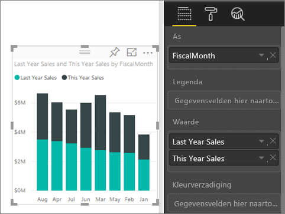
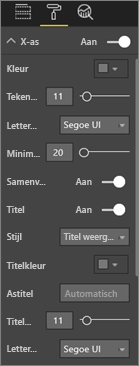
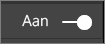
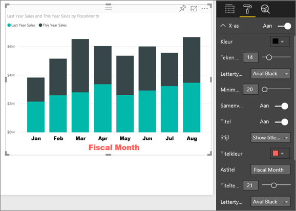
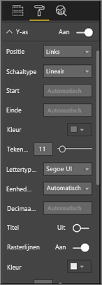
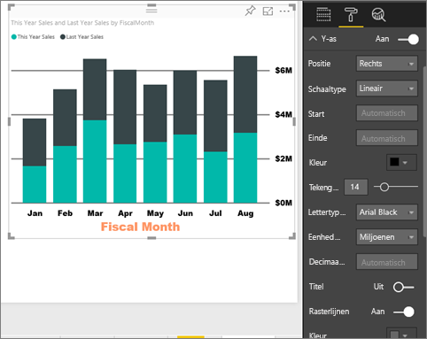
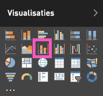
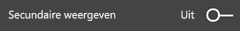
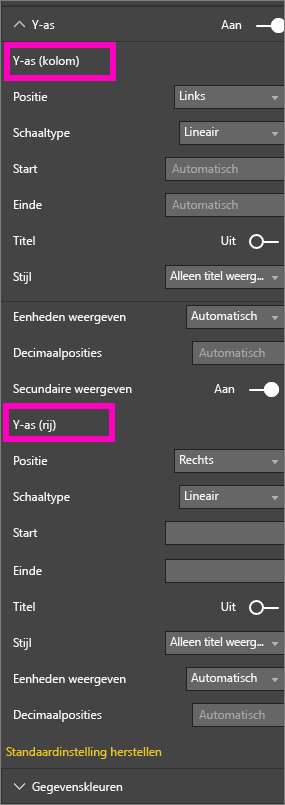
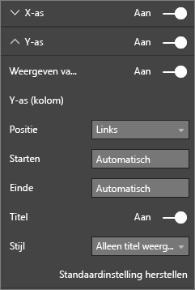

# De eigenschappen van de X-as en Y-as aanpassen
In deze zelfstudie leert u veel verschillende manieren om de X-as en Y-as van uw visualisaties aan te passen. Niet alle visualisaties hebben assen of kunnen worden aangepast. Zo hebben cirkeldiagrammen bijvoorbeeld geen assen. Bovendien verschillen de aanpassingsopties per visualisatie; er zijn te veel opties om ze in één artikel te behandelen. We werpen een blik op een aantal van de meestgebruikte as-aanpassingen, en maken u vertrouwd met het tabblad voor visuele opmaak in het rapportcanvas van Power BI.  

> [!NOTE]
> Deze pagina is zowel van toepassing op Power BI-service als op Power BI Desktop. Deze aanpassingen, die beschikbaar zijn wanneer **Opmaak** (het verfrollerpictogram  ) is geselecteerd, zijn ook beschikbaar in Power BI Desktop.  
>
>

Kijk hoe Amanda haar X en Y-as aanpast en de verschillende manieren laat zien waarop samenvoeging kan worden beheerd bij in- en uitzoomen. Volg vervolgens de stapsgewijze instructies onder de video om het zelf te proberen met behulp van het voorbeeld van een retailanalyse.

<iframe width="560" height="315" src="https://www.youtube.com/embed/9DeAKM4SNJM" frameborder="0" allowfullscreen></iframe>

## De X-as van een visualisatie in een rapport aanpassen
## Een visualisatie met een gestapelde grafiek maken
Meld u aan bij de Power BI-service en **open het rapport Voorbeeld van een retailanalyse** in de [Bewerkweergave](../service-interact-with-a-report-in-editing-view.md). Als u mee wilt doen, maakt u [verbinding met het voorbeeld van een retailanalyse](../sample-datasets.md).

1. Maak een nieuw kolomdiagram dat de waarde van de verkoop van dit jaar en van vorig jaar weergeeft per boekmaand.
2. Converteer het diagram naar een gestapeld kolomdiagram.

    

## De X-as aanpassen
1. Selecteer in het deelvenster Visualisaties en filters **Opmaak**  (het verfrollerpictogram  ) om de aanpassingsopties zichtbaar te maken.
2. Vouw de X-as-opties uit.

   
3. Schakel de X-as in of uit door de schuifknop Aan (of Uit) te selecteren. Laat deze voorlopig **Aan** staan.  Eén reden waarom u mogelijk de X-as zou willen uitschakelen, is om ruimte te maken voor meer gegevens.

    
4. Maak de kleur, de grootte en het lettertype van de tekst op. In dit voorbeeld hebben we de **Kleur** van de tekst ingesteld op zwart, de **Tekengrootte** op 14, en het **Lettertype** op Arial Black.  
5. Zet de titel van de X-as **Aan** en geef de naam van de X-as weer; in dit geval **FiscalMonth** (Boekmaand).  
6. Maak de kleur, de grootte en het lettertype van de titeltekst op.  In dit voorbeeld hebben we de **Titelkleur** ingesteld op oranje, de **Astitel** gewijzigd in **Fiscal Month** (Boekmaand), en **Tekengrootte titel** ingesteld op 21.
7. Als u op boekmaand wilt sorteren, selecteert u het beletselteken (...) in de rechterbovenhoek van de visualisatie en selecteert **Sorteren op FiscalMonth** (Boekmaand).

    Na al deze aanpassingen zou uw kolomdiagram er ongeveer als volgt moeten uitzien:

     

Als u alle aanpassingen van de X-as die we tot nu toe hebben gedaan wilt terugdraaien, selecteert u **Terugkeren naar standaardinstelling** onderaan het deelvenster **X-as**.

## De Y-as aanpassen
1. Vouw de Y-as-opties uit.

   

2. Schakel de Y-as in of uit door de schuifknop Aan (of Uit) te selecteren. Laat deze voorlopig **Aan** staan.  Een reden waarom u mogelijk de Y-as zou willen uitschakelen, is om ruimte te maken voor meer gegevens.
   
    
3. Verplaats de **Positie** van de Y-as naar rechts.
4. Maak de kleur, de grootte en het lettertype van de tekst op. In dit voorbeeld hebben we de **Kleur** van de tekst ingesteld op zwart, de **Tekengrootte** op 14, en het **Lettertype** op Arial Black.  
5. Laat **Weergave-eenheden** op miljoenen en **Aantal decimalen** op nul staan.
6. Deze visualisatie wordt niet beter met een titel voor de Y-as, laat **Titel** dus maar uitgeschakeld.  
7. We laten de rasterlijnen opvallen door de **Kleur** donkergrijs te maken, en **Streek** te vergroten naar 2.

    Na al deze aanpassingen zou uw kolomdiagram er ongeveer als volgt moeten uitzien:

     

## Visualisaties met dubbele Y-assen aanpassen
Eerst maakt u een Combinatiegrafiek waarmee u de impact kunt bekijken die het aantal winkels heeft op de verkoop.  Dit is dezelfde grafiek die we hebben gemaakt in de [Combinatiegrafiek-zelfstudie](power-bi-visualization-combo-chart.md). Vervolgens maakt u de dubbele y-assen op.

### Maak een grafiek met twee y-assen
1. Maak een nieuw lijndiagram waarin de **Sales (Verkoop) > Gross Margin last year % (Brutomarge% vorig jaar)** per **Time (Tijd) > FiscalMonth (Boekmaand)** wordt bijgehouden.
2. Sorteer de visualisatie op maand door het beletselteken (...) te selecteren en **Sort by Month** (Sorteren op maand) te kiezen

    

    > [NOTE]: For help sorting by month, see [sorting by other criteria](../consumer/end-user-change-sort.md#other)

    In januari was de brutomarge 35%, in april nemen we een piek (45%) waar, in juli daalde het brutomargepercentage en in augustus was er opnieuw een daling. Krijgen we een soortgelijk patroon voor afgelopen jaar en dit jaar te zien?
     
3. Voeg **Omzet van dit jaar > Waarde** en **Omzet van afgelopen jaar** aan het lijndiagram toe. De schaal van **BM % vorig jaar** (de blauwe lijn die langs de rasterlijn 0% loopt) is veel kleiner dan de schaal van **Verkoop**, waardoor het lastig is om de waarden te vergelijken. Een de percentages in de labels op de Y-as zijn absurd.      

    

5. Converteer het lijndiagram naar een Lijndiagram en gestapeld kolomdiagram, zodat de visualisatie eenvoudiger te lezen en te interpreteren is.

   

6. Sleep **Brutomarge% vorig jaar** van **Kolomwaarden** naar **Lijnwaarden**. Nu hebben we het gestapelde kolomdiagram dat we hierboven hebben gemaakt, ***plus*** een lijndiagram.  (Gebruik eventueel wat u hierboven hebt geleerd om de tekenkleur en-grootte van de assen op te maken.)
   
   In Power BI worden twee assen gemaakt, zodat de gegevenssets verschillend kunnen worden geschaald. Aan de linkerkant in dollars en aan de rechterkant in percentages.

   

### Maak de secundaire Y-as op
1. Selecteer het verfrollerpictogram in het deelvenster **Visualisaties** om de opmaakopties weer te geven.    
2. Selecteer de pijl-omlaag om de opties voor de Y-as uit te vouwen.    
3. Blader door de lijst totdat u de opties voor **Secundaire weergeven** ziet. Schakel **Secundaire weergeven** van **Uit** naar **Aan**.    

   

   

4. (Optioneel) Pas de twee assen aan. Als u de **Positie** voor de kolomas of de lijnas verwisselt, wisselen de twee assen van kant.

   

### Voeg titels toe aan beide assen
Met een visualisatie die zo ingewikkeld is, is het nuttig om astitels toe te voegen.  Titels helpen uw collega's het verhaal te begrijpen dat u met uw visualisatie wilt overbrengen.

1. Zet de **Titel** op **Aan** voor **Y-as (kolom)** en de **Y-as (rij)**.
2. Stel **Stijl** in op **Alleen titel weergeven**.

       
3. Uw Combinatiegrafiek bevat nu twee assen, beide met titels.

   

Zie voor meer informatie [Tips en trucs voor kleuropmaak, labels en aseigenschappen](service-tips-and-tricks-for-color-formatting.md).

## Overwegingen en probleemoplossing
Als de X-as door de eigenaar van het rapport wordt gecategoriseerd als een gegevenstype, wordt de optie **Type** weergegeven en kunt u kiezen tussen doorlopend of categorisch.

## Volgende stappen
Meer informatie over [visualisaties in Power BI-rapporten](power-bi-report-visualizations.md)

[Titels, ](power-bi-visualization-customize-title-background-and-legend.md)[achtergronden en legenda’s aanpassen](power-bi-visualization-customize-title-background-and-legend.md)

[Kleuren en aseigenschappen aanpassen](service-getting-started-with-color-formatting-and-axis-properties.md)

[Power BI - basisconcepten](../consumer/end-user-basic-concepts.md)

Hebt u nog vragen? [Misschien dat de Power BI-community het antwoord weet](http://community.powerbi.com/)
