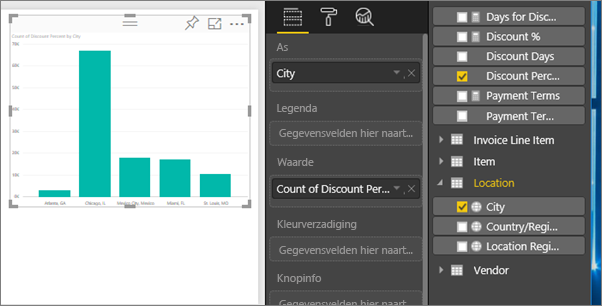
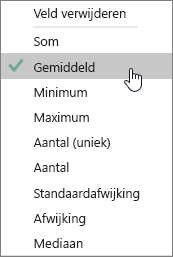
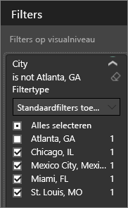
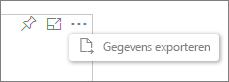
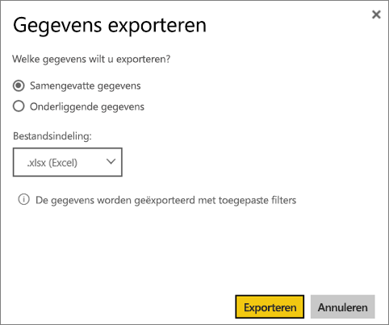
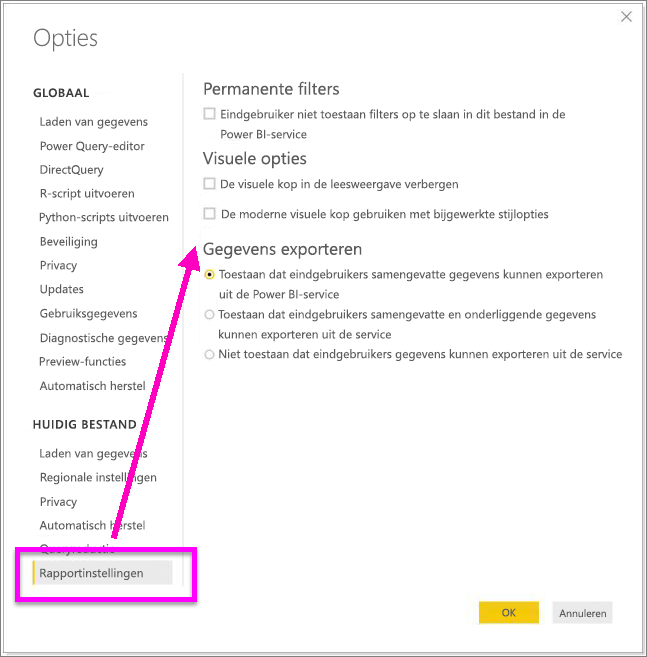

# Gegevens uit visualisaties exporteren
Als u de gegevens wilt zien die worden gebruikt om een visualisatie te maken, [kunt u die gegevens weergeven in Power BI](service-reports-show-data.md) of exporteren naar Excel als .xlsx- of .csv-bestand. Als u de optie voor het exporteren van de gegevens wilt gebruiken, hebt u een Pro- of Premium-licentie en machtigingen voor het bewerken van de gegevensset en het rapport nodig. 

Kijk hoe Will de gegevens van een van de visualisaties in zijn rapport exporteert, opslaat als .xlsx-bestand en opent in Excel. Volg vervolgens de stapsgewijze instructies onder de video om het zelf te proberen.

<iframe width="560" height="315" src="https://www.youtube.com/embed/KjheMTGjDXw" frameborder="0" allowfullscreen></iframe>

## Vanuit een visualisatie in een Power BI-dashboard
1. Selecteer het beletselteken in de rechterbovenhoek van de visualisatie.

    
2. Kies het pictogram **Gegevens exporteren**.

    
3. De gegevens worden geëxporteerd naar een .csv-bestand. Als de visualisatie is gefilterd, worden de gedownloade gegevens ook gefilterd.    
4. U wordt gevraagd het bestand op te slaan.  Nadat het is opgeslagen, opent u het .csv-bestand in Excel.

    

## Vanuit een visualisatie in een rapport
Als u wilt meedoen, opent u het rapport [Procurement analysis sample](../sample-procurement.md) (Voorbeeld van een inkoopanalyse) in de bewerkingsweergave. Voeg een nieuwe, lege rapportpagina toe. Volg vervolgens onderstaande stappen om een aggregatie en een filter op visualisatieniveau toe te voegen.

1. Maak een nieuw kolomdiagram.  Selecteer in het deelvenster Velden **Locatie > Plaats** en **Factuur > Kortingspercentage**.  Mogelijk moet u **Kortingspercentage** verplaatsen naar de Waarde-put. 

    
2. Wijzig de aggregatie voor **Kortingspercentage** van **Aantal** in **Gemiddelde**. Selecteer in de Waarde-put de pijl rechts van **Kortingspercentage** (er staat mogelijk **Aantal kortingspercentage**) en kies **Gemiddelde**.

    
3. Voeg een filter toe aan **Plaats** om **Atlanta** te verwijderen.

   

   Nu zijn we klaar om beide opties voor het exporteren van gegevens uit te proberen. 

4. Selecteer het beletselteken in de rechterbovenhoek van de visualisatie. Kies **Gegevens exporteren**.

   
5. Als uw visualisatie in Power BI Online een statistische functie heeft (een voorbeeld zou zijn als u **Aantal** wijzigt in *Gemiddelde*, *Som* of *Minimum*), hebt u twee opties: **Gegevensoverzicht** en **Onderliggende gegevens**. In Power BI Desktop hebt u alleen de optie voor **Samengevatte gegevens**. Zie voor hulp bij statistische functies [Statistische functies in Power BI](../service-aggregates.md).
    
6. Selecteer **Samengevatte gegevens** > **Exporteren** en kies .xlsx- of .csv. Power BI exporteert de gegevens.  Als u filters op de visualisatie hebt toegepast, worden de geëxporteerde gegevens geëxporteerd als gefilterd. Wanneer u **Exporteren** selecteert, wordt u gevraagd het bestand op te slaan. Nadat het is opgeslagen, opent u het bestand in Excel.

   **Samengevatte gegevens**: selecteer deze optie als u gegevens wilt exporteren voor wat u ziet in de visual.  Bij dit type uitvoer ziet u alleen de gegevens (kolommen en metingen) die u hebt gekozen om de visual te maken.  Als de visual een statistische functie bevat, exporteert u hiermee statistische gegevens. Als u bijvoorbeeld een staafdiagram met 4 balken hebt, krijgt u 4 rijen gegevens. Samengevatte gegevens zijn beschikbaar als .xlsx en .csv.

   In dit voorbeeld bevat onze Excel-export één totaal voor elke plaats. Omdat we Atlanta uitgefilterd hebben, is deze plaats niet opgenomen in de resultaten.  In de eerste rij van onze werkblad ziet u de filters die zijn gebruikt bij het extraheren van de gegevens uit Power BI.

   
7. Selecteer nu  **Onderliggende gegevens** > **Export** en kies .xlsx. Power BI exporteert de gegevens. Als u filters op de visualisatie had toegepast, worden de geëxporteerde gegevens geëxporteerd als gefilterd. Wanneer u **Exporteren** selecteert, wordt u gevraagd het bestand op te slaan. Nadat het is opgeslagen, opent u het bestand in Excel.

   >[!WARNING]
   >Door onderliggende gegevens te exporteren, kunnen gebruikers alle gedetailleerde gegevens zien: elke kolom in de gegevens. Power BI-servicebeheerders kunnen dit uitschakelen voor hun organisatie. Als u de eigenaar van een gegevensset bent, kunt u eigen kolommen instellen als ‘verborgen’, zodat ze niet worden weergegeven in de veldenlijst in Desktop of Power BI-service.

   **Onderliggende gegevens**: selecteer deze optie als u de gegevens in de visual ***en*** aanvullende gegevens uit het model wilt weergeven (bekijk de onderstaande grafiek voor meer informatie).  Als uw visualisatie een statistische functie bevat, wordt de statistische functie verwijderd als u *Onderliggende gegevens* selecteert. Wanneer u **Exporteren** selecteert, worden de gegevens geëxporteerd naar een .xlsx-bestand en wordt u gevraagd het bestand op te slaan. Nadat het is opgeslagen, opent u het bestand in Excel.

   In dit voorbeeld toont onze Excel-export één rij voor elke Plaats-rij in onze gegevensset, en het kortingspercentage voor dat ene item. Met andere woorden, de gegevens worden afgevlakt en niet geaggregeerd. In de eerste rij van onze werkblad ziet u de filters die zijn gebruikt bij het extraheren van de gegevens uit Power BI.  

   

## Details van de onderliggende gegevens exporteren
Wat u ziet wanneer u **Onderliggende gegevens** selecteert, varieert. Vraag uw beheerder of IT-afdeling voor meer informatie over deze details. In Power BI Desktop of Power Bi-service wordt een *meting* in de rapportweergave in de lijst met velden weergegeven met een rekenmachinepictogram . Metingen worden gedaan in Power BI Desktop, niet in Power BI-service.

| De visual bevat |                                                                              Wat u ziet in het exportbestand                                                                              |
|-----------------|-------------------------------------------------------------------------------------------------------------------------------------------------------------------------------------|
|   Statistische functies    |                                                 de *eerste* statistische functie en niet-verborgen gegevens uit de hele tabel voor die combinatie                                                  |
|   Statistische functies    | gerelateerde gegevens - als er voor de visuals gegevens worden gebruikt uit andere gegevenstabellen die *gerelateerd* zijn aan de gegevenstabel met de statistische functie (zolang deze relatie \*:1 of 1:1 is) |
|    Metingen     |                                      Alle metingen in de visual *en* alle metingen uit gegevenstabellen die een meting bevatten die in de visual wordt gebruikt                                      |
|    Metingen     |                                       Alle niet-verborgen gegevens uit tabellen die deze meting bevatten (zolang deze relatie \*:1 of 1:1 is)                                       |
|    Metingen     |                                      Alle gegevens van alle tabellen die zijn gerelateerd aan tabellen met de metingen via een keten van \*:1 van 1:1                                      |
|  Alleen metingen  |                                                   Alle niet-verborgen kolommen van alle gerelateerde tabellen (om de meting te kunnen uitbreiden)                                                   |
|  Alleen metingen  |                                                             Samengevatte gegevens voor alle dubbele rijen voor modelmetingen.                                                              |

### De opties voor exporteren instellen
Power BI-rapportontwikkelaars beheren welke opties voor het exporteren van gegevens beschikbaar zijn voor gebruikers. De opties zijn:
- Alleen exporteren van samengevatte gegevens toestaan (dit is de standaardinstelling voor nieuwe rapporten) 
- Exporteren van samengevatte en onderliggende gegevens toestaan (dit was de standaardinstelling vóór oktober 2018) 
- Exporteren van gegevens niet toestaan  

    > [!IMPORTANT]
    > We adviseren rapportontwerpers om de exportoptie voor oude rapporten indien nodig handmatig opnieuw in te stellen.

1. Als u deze opties wilt instellen, begint u in Power BI Desktop.

2. Selecteer in de linkerbovenhoek **Bestand** > **Opties en instellingen** > **Opties**. 

3. Selecteer onder **Huidig bestand** de optie **Rapportinstellingen**.

    

4. Maak uw keuze uit de vervolgkeuzelijst **Gegevens exporteren**.

U kunt deze instelling ook bijwerken in de Power BI-service.  

Let op: als de instellingen van de Power BI-beheerportal conflicteren met de rapportinstellingen voor het exporteren van gegevens, worden deze laatste instellingen overschreven door de portalinstellingen. 

## Beperkingen en overwegingen
* Het maximum aantal rijen dat uit **Power BI Desktop** en de **Power BI-service** naar .csv kan worden geëxporteerd, is 30.000.
* Het maximum aantal rijen dat naar .xlsx kan worden geëxporteerd, is 150.000.
* Exporteren met behulp van *onderliggende gegevens* werkt niet als de gegevensbron een liveverbinding met Analysis Services is en de versie ouder is dan 2016 is en de tabellen in het model niet over een unieke sleutel beschikken.  
* Exporteren met behulp van *onderliggende gegevens* werkt niet als de optie *Items zonder gegevens weergeven* is ingeschakeld voor de visualisatie die wordt geëxporteerd.
* Bij gebruik van DirectQuery is de maximale hoeveelheid gegevens die geëxporteerd kan worden 16 MB. Dit kan ertoe leiden dat minder dan het maximum aantal rijen wordt geëxporteerd, vooral als er veel kolommen zijn, gegevens die moeilijk te comprimeren zijn en andere factoren die de bestandsgrootte vergroten en het aantal geëxporteerde rijen verminderen.
* Als de visual gebruikmaakt van gegevens uit meer dan één gegevenstabel en er geen relatie bestaat voor deze tabellen in het gegevensmodel, worden alleen gegevens voor de eerste tabel geëxporteerd. 
* Aangepaste visuals en R-visuals worden momenteel niet ondersteund.
* Het exporteren van gegevens is niet beschikbaar voor gebruikers buiten uw organisatie die een dashboard gebruiken dat met ze is gedeeld. 
* In Power BI kunt u de naam van een veld (kolom) wijzigen door te dubbelklikken op het veld en een nieuwe naam in te voeren.  Deze nieuwe naam wordt een *alias* genoemd. Het is mogelijk dat een Power BI-rapport hierdoor dubbele veldnamen bevat, maar duplicaten zijn niet toegestaan in Excel.  Wanneer de gegevens naar Excel worden geëxporteerd, worden voor de veldaliassen weer hun oorspronkelijke veld-/kolomnamen gebruikt.  
* Als er unicode-tekens in het .csv-bestand staan, wordt de tekst in Excel mogelijk niet correct weergegeven. Het werkt wel goed als u het bestand opent in Kladblok. Voorbeelden van unicode-tekens zijn valutasymbolen en woorden in vreemde talen. U kunt dit probleem vermijden door het .csv-bestand in Excel te importeren in plaats van het rechtstreeks te openen. Ga als volgt te werk:

  1. Open Excel
  2. Selecteer op het tabblad **Gegevens** **Externe gegevens ophalen** > **Uit tekst**.
* Power BI-beheerders hebben de mogelijkheid het exporteren van gegevens uit te schakelen.

Hebt u nog vragen? [Misschien dat de Power BI-community het antwoord weet](http://community.powerbi.com/)

