# Visualisatie Belangrijkste beïnvloeders
Met de visual Belangrijkste beïnvloeders krijgt u meer inzicht in de beïnvloedingsfactoren van een metrisch gegeven waarin u geïnteresseerd bent. Uw gegevens worden geanalyseerd en de factoren die van belang zijn worden gerangschikt en als belangrijkste beïnvloeders weergegeven. Stel dat u graag wilt weten welke factoren het personeelsverloop beïnvloeden. Eén factor kan de contractduur zijn en een andere de leeftijd van de medewerkers. 
 
## Wanneer kunt u gebruikmaken van Belangrijkste beïnvloeders? 
De visual Belangrijkste beïnvloeders is ideaal in de volgende situaties: 
- Als u wilt zien welke factoren invloed hebben op het te analyseren metrische gegeven.

- Als u het relatieve belang van deze factoren wilt vergelijken. Hebben kortlopende arbeidscontracten bijvoorbeeld meer invloed op het verloop dan langlopende contracten? 

## Vereisten voor Belangrijkste beïnvloeders 
Het te analyseren metrische gegeven moet een categorisch veld zijn.    

## Functies van de visual Belangrijkste beïnvloeders

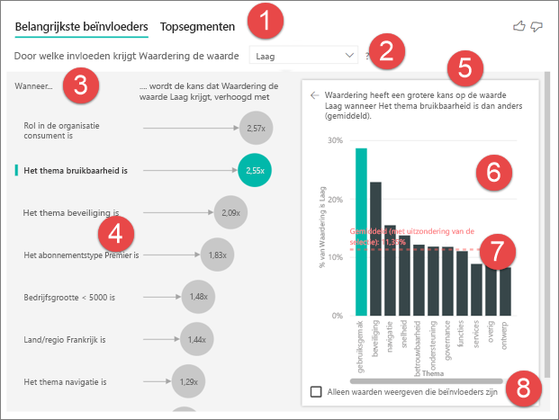    

1. ***Tabbladen***: selecteer een tabblad om te schakelen tussen weergaven. Belangrijkste beïnvloeders toont de belangrijkste factoren die invloed hebben op de geselecteerde metrische waarde. Topsegmenten toont de topsegmenten die van invloed zijn op de geselecteerde metrische waarde. Een *segment* bestaat uit een combinatie van waarden.  Eén segment kan bijvoorbeeld bestaan uit gebruikers die al minstens twintig jaar klant zijn en in de regio West wonen. 

2. ***Vervolgkeuzelijst***: de waarde van het te onderzoeken metrische gegeven. In dit voorbeeld kijken we naar het metrische gegeven **waardering** en is de waarde die we hebben geselecteerd **laag**.    

3. ***Aanpassing***: helpt ons om de visual in het linkerdeelvenster te interpreteren. 

4. ***Linkerdeelvenster***: het linkerdeelvenster bevat één visual.  In dit geval toont het linkerdeelvenster een lijst met de belangrijkste beïnvloeders.

5. ***Aanpassing***: helpt ons om de visual in het rechterdeelvenster te interpreteren.

6. ***Rechterdeelvenster***: het rechterdeelvenster bevat één visual. In dit geval worden in het kolomdiagram alle waarden voor de **belangrijkste beïnvloeder** **Thema** weergegeven, die is geselecteerd in het linkerdeelvenster. De specifieke waarde (**Bruikbaarheid**) in het linkerdeelvenster is groen en alle andere waarden voor **Thema** zijn zwart.

7. ***Lijn voor gemiddelde***: het gemiddelde wordt berekend voor alle andere mogelijke waarden voor **Thema** dan **bruikbaarheid**. De berekening is dus van toepassing op alle zwarte waarden. Er wordt mee aangegeven door welk percentage van de andere **Thema's** de waardering 'laag' werd veroorzaakt. Met andere woorden, wanneer een klant een waardering geeft, geeft die klant ook de reden of het **thema** voor de waardering op. Thema's zijn bijvoorbeeld Bruikbaarheid, Snelheid, Beveiliging, enzovoort. Het **Thema** **Bruikbaarheid** is de op een na belangrijkste beïnvloeder voor een lage waardering, volgens onze visual in het linkerdeelvenster. Als we het gemiddelde van alle andere thema's en hun bijdrage aan de waardering **laag** berekenen, krijgen we het resultaat dat hier in het rood wordt weergegeven. 

8. ***Selectievakje***: alleen waarden tonen die beïnvloeders zijn.

## Een visual Belangrijkste beïnvloeders maken 
 
Bekijk deze video om te leren hoe u een visual Belangrijkste beïnvloeders maakt en volg daarna de onderstaande stappen om er zelf een te maken. 

<iframe width="560" height="315" src="https://www.youtube.com/embed/fDb5zZ3xmxU" frameborder="0" allow="accelerometer; autoplay; encrypted-media; gyroscope; picture-in-picture" allowfullscreen></iframe>

Onze productmanager wil nagaan welke factoren ertoe leiden dat klanten negatieve beoordelingen over onze cloudservice achterlaten.  Open het [PBIX-bestand Klantenfeedback](https://github.com/Microsoft/powerbi-desktop-samples/blob/master/2019/customerfeedback.pbix) in Power BI Desktop om het voorbeeld verder te volgen. U kunt ook het [Excel-bestand Klantenfeedback voor Power BI-service of Power BI Desktop](https://github.com/Microsoft/powerbi-desktop-samples/blob/master/2019/customerfeedback.xlsx) downloaden. 

> [!NOTE]
> De gegevensset Klantenfeedback is gebaseerd op [Moro et al., 2014] S. Moro, P. Cortez en P. Rita. A Data-Driven Approach to Predict the Success of Bank Telemarketing. Decision Support Systems, Elsevier, 62:22-31, juni 2014 

1. Open het rapport en selecteer het tabblad Belangrijkste beïnvloeders.  

    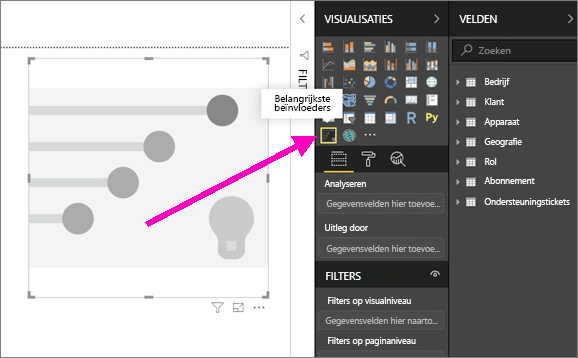

2. Sleep het metrische gegeven dat u wilt onderzoeken naar het veld **Analyseren**. Het veld **Analyseren** ondersteunt alleen categorische (niet-doorlopende) variabelen. Omdat we willen nagaan wat een klant beïnvloedt om onze service de waardering **Laag** te geven, selecteren we **Klantentabel** > **Waardering**.    
3. Sleep vervolgens velden waarvan u denkt dat ze van invloed kunnen zijn op **Waardering** naar **Uitleg door**. U kunt er zoveel velden naartoe slepen als u wilt. In dit geval beginnen we met de volgende velden: 
    - Land-regio 
    - Rol in organisatie 
    - Abonnementstype 
    - Bedrijfsgrootte 
    - Thema     
4. Omdat we geïnteresseerd zijn in negatieve waarderingen, selecteert u **Laag** in de vervolgkeuzelijst voor **Wat invloed heeft op de waardering**.  

    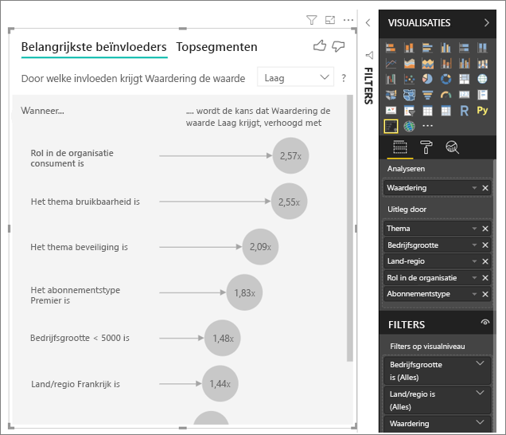

De analyse wordt uitgevoerd op het tabelniveau van het te analyseren veld. In dit geval zijn we geïnteresseerd in het metrische gegeven **Waardering**, dat wordt gedefinieerd op klantniveau (elke klant heeft ofwel een hoge score ofwel een lage score gegeven). Al onze verklarende factoren moeten op klantniveau zijn gedefinieerd om bruikbaar te zijn voor de visual. 

In het bovenstaande voorbeeld hebben al onze verklarende factoren een een-op-een- of een veel-op-eenrelatie met ons metrische gegeven. Aan elke score is bijvoorbeeld exact één thema gekoppeld (namelijk het belangrijkste thema van de klantbeoordeling). Klanten komen ook uit één land, hebben één type lidmaatschap en één rol in hun organisatie. Daarom zijn onze verklarende factoren al kenmerken van een klant en zijn er geen transformaties nodig. Ze zijn direct te gebruiken in de visual. 

Verderop in deze zelfstudie gaan we in op complexere voorbeelden met een-op-veelrelaties. In die gevallen moeten de kolommen eerst omlaag worden geaggregeerd naar klantniveau voordat de analyse kan worden uitgevoerd.  

Metingen en aggregaties die als verklarende factoren worden gebruikt, worden ook geëvalueerd op het tabelniveau van het metrische gegeven **Analyseren**. Hiervan volgen verderop in dit artikel enkele voorbeelden. 

## Categorische belangrijkste beïnvloeders interpreteren 
Laten we eens gaan kijken naar de belangrijkste beïnvloeders voor lage waarderingen. 

### De belangrijkste factor die de kans op een lage waardering beïnvloedt

In onze organisatie hebben we drie rollen: gebruikers, beheerders en uitgevers. We zien dat de rol gebruiker de belangrijkste factor is die bijdraagt aan een lage waardering. 

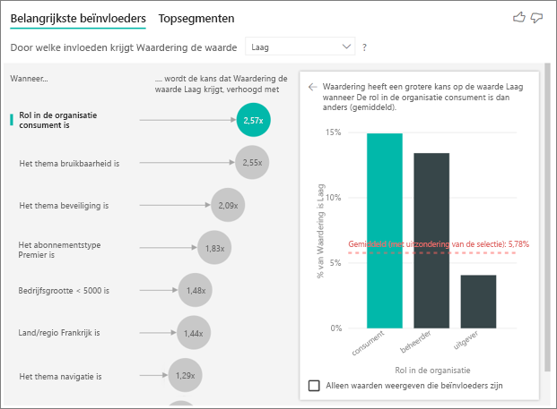

Om precies te zijn is de kans 2,57 maal groter dat onze gebruikers ons een negatieve score geven. In de grafiek Belangrijkste beïnvloeder staat **Rol in organisatie is gebruiker** boven in de lijst aan de linkerkant. Doordat we **Rol in organisatie is gebruiker** hebben geselecteerd, worden in het Power BI-deelvenster rechts aanvullende details getoond: de vergelijkende invloed van elke **rol** op de kans op een lage waardering.
  
- 14,93 procent van de gebruikers geeft een lage score  
- Gemiddeld krijgen we van 5,78 procent van alle andere rollen een lage score 
- De kans dat we een lage score krijgen van gebruikers is dus 2,57 keer groter dan van alle andere rollen (het verschil tussen de groene staaf en de rode stippellijn) 

### De op een na belangrijkste factor die de kans op een lage waardering beïnvloedt

In de visual Belangrijkste beïnvloeder kunnen factoren uit veel verschillende variabelen worden vergeleken en gerangschikt.  Onze op een na belangrijkste beïnvloeder heeft niets te maken met **Rol in organisatie**.  Selecteer de op een na belangrijkste beïnvloeder in de lijst: **Thema is bruikbaarheid**. 

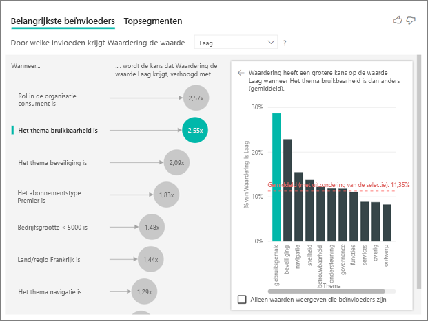

Hier ziet u dat de op een na belangrijkste factor is gerelateerd aan het thema van de klantbeoordeling. Klanten die opmerkingen maakten over de *bruikbaarheid* van het product waren 2,21 keer vaker geneigd een lage score te geven dan klanten die opmerkingen maakten over andere thema's, zoals de betrouwbaarheid, het ontwerp of de snelheid. 

Op de visuals is te zien dat het gemiddelde (rode stippellijn) is gewijzigd van 5,78 in 11,34 procent. Het gemiddelde is dynamisch omdat dit wordt gebaseerd op het gemiddelde van alle andere waarden. In het geval van de belangrijkste beïnvloeder werd de rol van klant uitgesloten van het gemiddelde, en in het geval van de op een na belangrijkste werd het thema bruikbaarheid uitgesloten. 
 
Bij inschakeling van het vakje onderaan de visual wordt de visual gefilterd zodat uitsluitend de invloedrijke waarden worden weergegeven (in dit geval rollen die een lage score beïnvloeden). Daarom stappen we over van het kijken naar twaalf thema's naar de vier die door Power BI zijn geïdentificeerd als invloedrijk voor een lage waardering. 

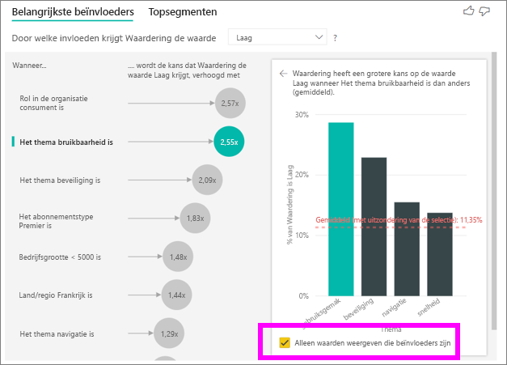

## Interactie met andere visuals 
 
Steeds wanneer een gebruiker op een slicer, filter of andere visual op het canvas klikt, voert de visual Belangrijkste beïnvloeders de analyse opnieuw uit voor het nieuwe deel van de gegevens. Laten we bijvoorbeeld het veld Bedrijfsgrootte naar het rapport slepen en dit als slicer gebruiken. We willen zien of de belangrijkste beïnvloeders voor onze zakelijke klanten (bedrijven met meer dan 50.000 medewerkers) anders zijn dan voor de algemene populatie.  
 
Door **> 50.000** te selecteren, wordt de analyse opnieuw uitgevoerd en zien we dat de beïnvloeders zijn veranderd. Voor grote zakelijke klanten heeft de belangrijkste beïnvloeder voor een lage waardering een **Thema** dat is gerelateerd aan **beveiliging**. We willen dit mogelijk verder onderzoeken om te zien of er specifieke beveiligingsfuncties zijn waarover onze grote klanten ontevreden zijn. 

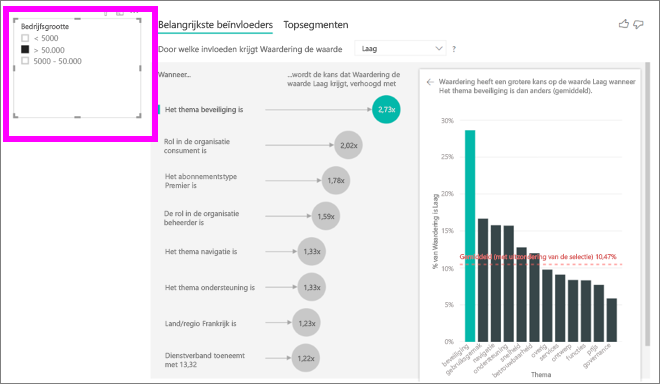

## Doorlopende belangrijkste beïnvloeders interpreteren 
 
Tot nu toe hebben we de visual gebruikt om te verkennen welke invloed verschillende categorische velden hebben op een lage waardering. Het is ook mogelijk om doorlopende factoren (bijvoorbeeld leeftijd, hoogte, prijs) op te nemen in Uitleg door. Laten we eens kijken wat er gebeurt als we Gebruiksduur van de tabel Klant bij Uitleg door plaatsen. Gebruiksduur geeft aan hoelang de klant al gebruikmaakt van de service. 
 
We merken dat als de **Gebruiksduur** toeneemt, de kans op een lage waardering ook toeneemt. Deze trend geeft aan dat onze trouwste klanten sneller geneigd zijn een negatieve score te geven. Dit is een interessant inzicht, waar we later op terugkomen.  
 
De visualisatie maakt zichtbaar dat steeds als de gebruiksduur 13,44 maanden toeneemt, de gemiddelde kans op een lage score 1,23 maal groter wordt. In dit geval geeft 13,44 maanden de standaarddeviatie van gebruiksduur aan. Het verkregen inzicht geeft dus aan wat de invloed van het verhogen van de gebruiksduur met een standaardwaarde (de standaarddeviatie van gebruiksduur) is op de kans op een lage waardering. 
 
Het spreidingsdiagram rechts toont het gemiddelde percentage lage waarderingen voor elke gebruiksduur en bevat ook een trendlijn om de helling aan te geven.  

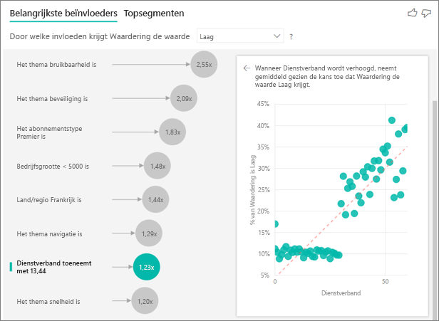

## Metingen/aggregaties interpreteren als belangrijkste beïnvloeders 
 
Ten slotte kunnen gebruikers metingen en aggregaties gebruiken als verklarende factoren binnen hun analyse. We willen bijvoorbeeld zien wat de gevolgen zijn van het aantal ondersteuningstickets van klanten of de gemiddelde duur van een open ticket op de score die we krijgen. 
 
In dit geval willen we zien of het aantal ondersteuningstickets van een klant invloed heeft op de score die hij/zij ons geeft. Daarom gaan we de ondersteuningsticket-id van de tabel Ondersteuningsticket opvoeren. Omdat een klant meerdere ondersteuningstickets kan hebben, moeten we de id aggregeren naar klantniveau. Deze aggregatie is belangrijk omdat we de analyse uitvoeren op klantniveau en alle beïnvloedingsfactoren dus moeten worden gedefinieerd op dat granulariteitsniveau. 
 
We gaan kijken naar het aantal id's (daarom wordt aan elke klantrij het aantal ondersteuningstickets gekoppeld). In dit geval zien we dat als het aantal ondersteuningstickets toeneemt, de kans op een lage waardering 5,51 maal groter wordt. Aan de rechterkant van de visual staat het gemiddelde aantal ondersteuningstickets per waarderingswaarde (geëvalueerd op klantniveau). 

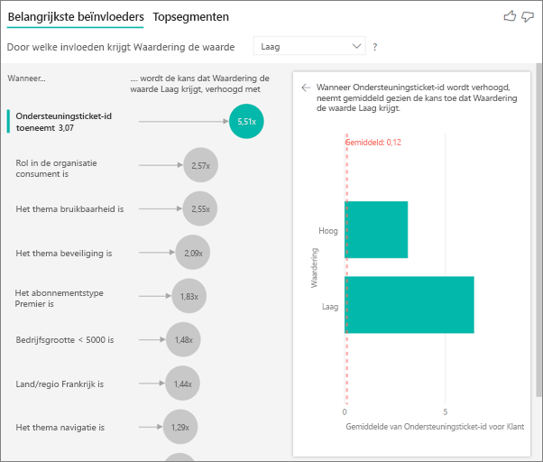

## De resultaten interpreteren: topsegmenten 
 
Terwijl gebruikers op het tabblad Belangrijkste beïnvloeders elke factor afzonderlijk kunnen beoordelen, kunnen gebruikers schakelen naar Topsegmenten om te zien wat voor gevolgen een combinatie van factoren heeft op het metrische gegeven dat ze analyseren. 
 
Topsegmenten biedt aanvankelijk een overzicht van alle segmenten die zijn gedetecteerd door Power BI. In het onderstaande voorbeeld zien we dat er zes segmenten zijn gevonden. Deze segmenten zijn gerangschikt op het percentage lage waarderingen binnen het segment. Segment 1 heeft bijvoorbeeld 74,3 procent lage klantwaarderingen.  Hoe hoger de bel, hoe hoger het aandeel lage waarderingen. De grootte van de bel geeft aan hoeveel klanten er binnen het segment zijn. 

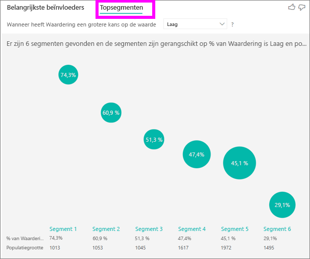

Bij het selecteren van een bel wordt ingezoomd op de details van dat segment. Als we bijvoorbeeld Segment 1 selecteren, zien we dat deze bestaat uit relatief vaste klanten (langer dan 29 maanden bij ons) die een groot aantal ondersteuningstickets hebben (meer dan vier). Ook zien we dat het geen uitgevers zijn (en het dus gebruikers of beheerders moeten zijn).  
 
Van deze groep heeft 74,3 procent een lage waardering gegeven. De gemiddelde klant geeft in 11,7 procent van de gevallen een lage waardering, dus heeft dit segment een significant hoger aandeel in de lage waarderingen (63 procentpunten hoger). We zien ook dat segment 1 ongeveer 2,2 procent van de gegevens bevat en dus een relevant deel van de populatie vertegenwoordigt. 

## Aandachtspunten en probleemoplossing 
 
**Wat zijn de beperkingen voor de preview?** 
 
De visual Belangrijkste beïnvloeders is momenteel in openbare preview, en er zijn enkele beperkingen waarmee gebruikers rekening moeten houden. Functies die momenteel niet beschikbaar zijn, zijn onder meer: 
- Het analyseren van metrische gegevens die aggregaties/metingen zijn 
- Gebruik van de visual in Power BI Embedded
- Gebruik van de visual in mobiele Power BI-apps
- RLS-ondersteuning 
- Ondersteuning van Direct Query 
- Ondersteuning voor Liveverbindingen 
 
**Er wordt een foutbericht weergegeven dat er geen beïnvloeders/segmenten zijn gevonden. Hoe komt dat?**  

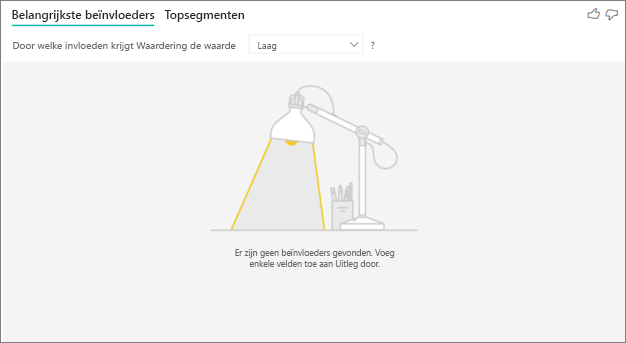

Deze fout treedt op wanneer u velden hebt opgenomen in **Uitleg door**, maar er geen beïnvloeders zijn gevonden.   
- U hebt het metrische gegeven dat u analyseerde, opgenomen bij zowel Analyseren als Uitleg door (u moet het verwijderen bij **Uitleg door**) 
- Uw verklarende velden hebben te veel categorieën met slechts enkele waarnemingen. Hierdoor is het voor de visualisatie lastig te bepalen welke factoren beïnvloeders zijn omdat het moeilijk is te generaliseren op basis van een handjevol waarnemingen 
- Uw verklarende factoren hebben voldoende waarnemingen om te generaliseren, maar er zijn geen betekenisvolle correlaties gevonden om verslag over uit te brengen in de visualisatie 
 
**Er wordt een foutbericht weergegeven dat het metrische gegeven dat ik analyseer niet voldoende gegevens bevat om de analyse op uit te voeren. Hoe komt dat?**  

Voor de visualisatie wordt gezocht naar patronen in de gegevens voor één groep (bijvoorbeeld klanten die een lage waardering gaven) in vergelijking met andere groepen (bijvoorbeeld klanten die een hoge waardering gaven). Als de gegevens in uw model weinig waarnemingen bevatten, is het moeilijk om patronen te vinden. Als er niet voldoende gegevens zijn om betekenisvolle beïnvloeders te vinden, wordt er in de visualisatie aangegeven dat er meer gegevens nodig zijn om de analyse uit te voeren. Het is aan te raden minstens honderd waarnemingen voor de geselecteerde staat te hebben (klanten die afhaken) en ten minste tien waarnemingen voor de staten die u gebruikt voor de vergelijking (klanten die niet afhaken).  
 
**Er wordt een foutbericht weergegeven dat een veld in Uitleg door niet uniek is ten opzichte van de tabel die het te analyseren metrische gegeven bevat. Hoe komt dat?**  
 
De analyse wordt uitgevoerd op het tabelniveau van het te analyseren veld. Als u bijvoorbeeld de feedback van klanten op uw service analyseert, hebt u wellicht een tabel die aangeeft of een klant een hoge of lage waardering gaf. In dit geval zou uw analyse moeten worden uitgevoerd op het niveau van de klanttabel. 

Deze fout ontstaat als u een gerelateerde tabel hebt die is gedefinieerd op een gedetailleerder niveau dan de tabel die uw metrische gegeven bevat. We illustreren dit met een voorbeeld: 
 
- U analyseert wat klanten beïnvloedt om uw service laag te waarderen 
- U wilt graag weten of het apparaat waarop klanten van de service gebruikmaken, invloed heeft op hun beoordeling 
- Een klant kan de service op verschillende manieren gebruiken   
- In het onderstaande voorbeeld gebruikt klant 10.000.000 zowel een browser als een tablet om met de service te werken 

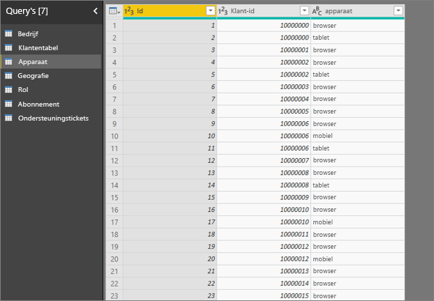

Als u probeert de apparaatkolom als een verklarende factor te gebruiken, wordt de volgende fout weergegeven: 

Dit komt doordat het apparaat niet op klantniveau is gedefinieerd: één klant kan op meerdere apparaten gebruikmaken van de service. De visualisatie kan alleen patronen vinden als het apparaat een kenmerk van de klant wordt. In dit geval heb ik verschillende opties om het probleem op te lossen, afhankelijk van mijn begrip van het bedrijf: 
 
- Ik kan de samenvatting van apparaat bijvoorbeeld wijzigen in aantal als ik denk dat het aantal apparaten invloed kan hebben op de score die een klant geeft 
- Ik kan de apparaatkolom draaien om te zien of de service op een specifiek apparaat invloed heeft op de waardering van de klant  
 
In dit voorbeeld heb ik mijn gegevens gedraaid om nieuwe kolommen te maken voor browser, mobiel en tablet. Nu kan ik deze gebruiken in Uitleg door. Alle apparaten blijken beïnvloeders te zijn, waarbij de browser de grootste invloed heeft op de score van de klant. 

Om precies te zijn, zijn klanten die de browser niet voor de service gebruiken 3,79 maal vaker geneigd een lage score te geven dan degenen die dat wel doen. Lager in de lijst zien we dat voor mobiel gebruik het omgekeerde geldt. Klanten die de mobiele app gebruiken, zijn meer geneigd een lagere score te geven dan degenen die dat niet doen.  

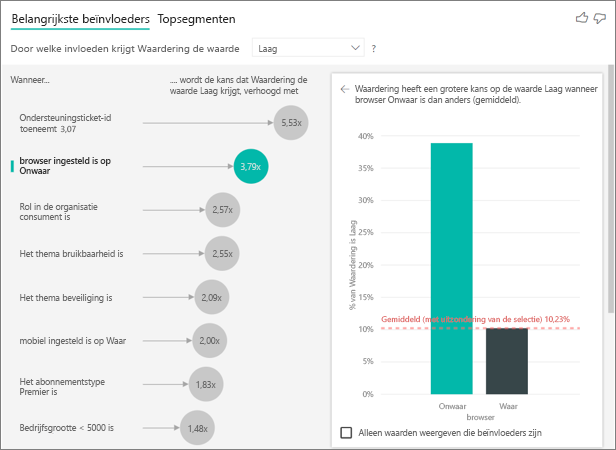

**Er wordt een waarschuwing weergegeven dat er geen metingen zijn opgenomen in mijn analyse. Hoe komt dat?** [2052261] 

De analyse wordt uitgevoerd op het tabelniveau van het te analyseren veld. Als u het klantverloop analyseert, hebt u mogelijk een tabel die aangeeft of een klant is afgehaakt of niet. In dit geval zou uw analyse moeten worden uitgevoerd op klanttabelniveau.
 
Metingen en aggregaties worden standaard op dat tabelniveau geanalyseerd. Als we een meting voor Gemiddelde maandelijkse uitgaven zouden hebben, zou die op klanttabelniveau worden geanalyseerd.  

Als de klanttabel geen unieke id heeft, kunnen we de meting niet evalueren en wordt deze genegeerd bij de analyse. Dit kunt u voorkomen door ervoor te zorgen dat uw metrische gegeven (in dit geval de klanttabel) een unieke id heeft (bijvoorbeeld klant-id). Het is ook heel eenvoudig om een indexkolom toe te voegen met behulp van Power Query.
 
**Er wordt een waarschuwing weergegeven dat het metrische gegeven dat ik analyseer meer dan tien unieke waarden bevat en dat dit de kwaliteit van de analyse kan beïnvloeden. Hoe komt dat?**  

De AI-visualisatie is geoptimaliseerd voor het analyseren van categorieën (bijvoorbeeld Verloop is Ja of Nee, Klanttevredenheid is Hoog, Gemiddeld of Laag, enzovoort.) Verhoging van het aantal te analyseren categorieën betekent dat we minder waarnemingen per categorie hebben, waardoor er moeilijker patronen in de gegevens kunnen worden gevonden. 

Het wordt aanbevolen om vergelijkbare waarden te groeperen tot één eenheid om sterkere beïnvloeders te vinden. Als u bijvoorbeeld een metrisch gegeven voor prijs hebt, krijgt u waarschijnlijk betere resultaten als u vergelijkbare prijzen groepeert in buckets als Hoog, Gemiddeld, Laag in plaats van afzonderlijke prijspunten te gebruiken. 

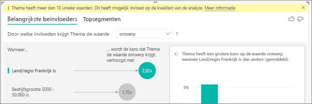

**Er zijn factoren in mijn gegevens die belangrijkste beïnvloeders lijken te zijn, maar dat toch niet zijn. Hoe kan dat?**

In het onderstaande voorbeeld zien we dat klanten die gebruikers zijn, lage waarderingen beïnvloeden (14,93 procent van de waarderingen is laag). Het is opmerkelijk dat de beheerdersrol ook een groot aandeel lage waarderingen heeft (13,42 procent), maar niet als een beïnvloeder wordt beschouwd. 

Dit komt doordat er bij het zoeken naar beïnvloeders ook rekening wordt gehouden met het aantal gegevenspunten. In het onderstaande voorbeeld hebben we ruim 29.000 consumenten en 10 keer zo weinig beheerders (ongeveer 2.900). Bovendien gaf slechts 390 van hen een lage waardering. Er zijn daarom niet voldoende gegevens beschikbaar voor de visual om te bepalen of deze beheerderswaarderingen echt een patroon vormen of dat het om een toevalstreffer gaat.  

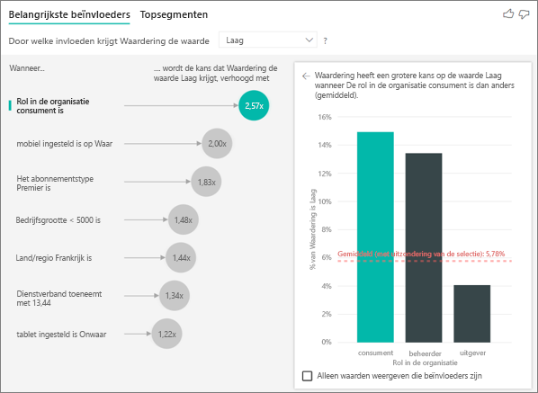

**Hoe worden belangrijkste beïnvloeders berekenend?**

Achter de schermen wordt in de AI-visualisatie met behulp van [ML.NET](https://dotnet.microsoft.com/apps/machinelearning-ai/ml-dotnet) een logistieke regressie uitgevoerd om de belangrijkste beïnvloeders te berekenen. Een logistieke regressie is een statistisch model waarin verschillende groepen met elkaar worden vergeleken. Als we op zoek zouden zijn naar de beïnvloeders van lage waarderingen, zou via de logistieke regressie worden gekeken naar de verschillen tussen klanten die een lage en hoge waardering gaven. Als we meerdere categorieën zouden hebben (een hoge, neutrale en lage score), zou er worden gekeken naar de verschillen tussen klanten die een lage waardering gaven en klanten die geen lage waardering gaven (dus in welk opzicht ze verschillen van degenen die een hoge OF neutrale waardering gaven). 
 
Via de logistieke regressie wordt gezocht naar patronen in de gegevens, in dit geval naar de verschillen tussen klanten die een lage en hoge waardering gaven. Er kan bijvoorbeeld uit komen dat klanten die veel ondersteuningstickets hebben, een veel hoger percentage lage waarderingen geven dan degenen met weinig of geen ondersteuningstickets.
 
Bij de logistieke regressie wordt ook rekening gehouden met het aantal aanwezige gegevenspunten. Als klanten met een beheerdersrol bijvoorbeeld in verhouding meer negatieve waarderingen geven, maar er slechts een handvol beheerders is, wordt dit niet als een invloedrijke factor beschouwd. Dit komt omdat er niet voldoende gegevenspunten beschikbaar zijn om een patroon uit af te leiden. Er wordt een statistische test (Wald-test) gebruikt om te bepalen of een factor als beïnvloeder wordt beschouwd. In de visual wordt een p-waarde (overschrijdingskans) van 0,05 gebruikt om de drempelwaarde te bepalen. 

**Hoe worden segmenten berekend?**

Achter de schermen wordt in de AI-visualisatie met behulp van [ML.NET](https://dotnet.microsoft.com/apps/machinelearning-ai/ml-dotnet) een beslissingsstructuur uitgevoerd om interessante subgroepen te vinden. Het doel van de beslissingsstructuur is om een subgroep te krijgen van gegevenspunten met een relatief hoge waarde van het metrische gegeven waarin we geïnteresseerd zijn (bijvoorbeeld klanten die een lage waardering gaven). 

In de beslissingsstructuur worden alle verklarende factor bekeken en wordt geprobeerd te beredeneren welke factor de beste afsplitsing oplevert. Als we de gegevens bijvoorbeeld zodanig filteren dat er alleen grote zakelijke klanten overblijven, scheiden we daarmee dan klanten af die ons een hoge of juist lage waardering gaven? Of is het misschien beter zodanig te filteren dat er alleen klanten overblijven die opmerking maakten over de beveiliging? 

Na de afsplitsing wordt er gekeken naar die gegevenssubgroep (bijvoorbeeld klanten die een opmerking maakten over de beveiliging) en wordt er geprobeerd te achterhalen wat de volgende beste afsplitsing voor die gegevens zou zijn. Na elke afsplitsing wordt er ook nagegaan of het aantal gegevenspunten voldoende is om een representatieve groep te vormen. In dat geval kan er een patroon uit worden afgeleid, terwijl het anders gewoon kan gaan om een anomalie in de gegevens in plaats van een echt segment. (Er wordt een andere statistische test toegepast om de statistische significantie van de afspitsingsvoorwaarde te testen, met een p-waarde van 0,05). 

Zodra de beslissingsstructuur is voltooid, worden alle afsplitsingen (beveiligingsopmerkingen, grote ondernemingen) apart genomen en worden er Power BI-filters gemaakt. Deze combinatie van filters wordt verpakt als een segment in de visual. 
 
**Waarom worden bepaalde factoren beïnvloeders of zijn ze dat niet langer als ik meer velden naar Uitleg door sleep?**

Alle verklarende factoren worden bij elkaar geëvalueerd in de visualisatie. Dit betekent dat factoren die op zichzelf beïnvloeders zijn, dat niet meer zijn als er ook met andere factoren rekening wordt gehouden. Stel dat we analyseren wat de huizenprijs opdrijft en dat het aantal slaapkamers en de grootte van het huis de verklarende factoren zijn: 
- Meer slaapkamers kan op zich de prijs opdrijven 
- Als we de huisgrootte meenemen in de analyse, betekent dit dat we nu gaan kijken wat er met de slaapkamers gebeurt als we de huisgrootte constant houden 
- Als we de huisgrootte constant houden op 140 vierkante meter, is het onwaarschijnlijk dat de huisprijs aanzienlijk zal stijgen als het aantal slaapkamers blijft toenemen. Het aantal slaapkamers is wellicht niet meer zo belangrijk als voordat de huisgrootte werd meegerekend. 

## Volgende stappen
[Combinatiegrafieken in Power BI](power-bi-visualization-combo-chart.md)

[Visualization types in Power BI](power-bi-visualization-types-for-reports-and-q-and-a.md) (Typen visualisaties in Power BI)
