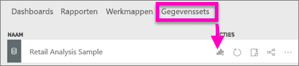
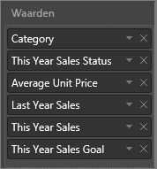
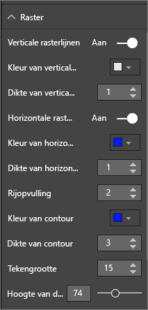
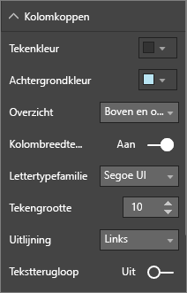
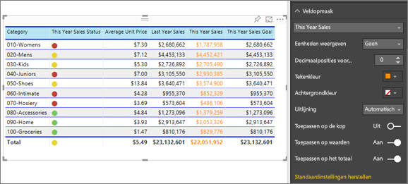
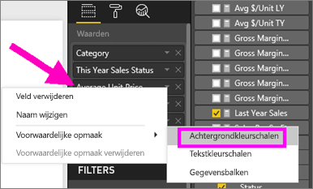
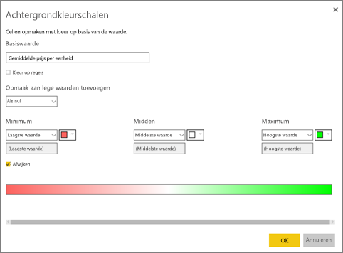
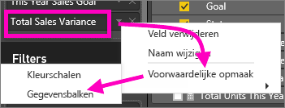
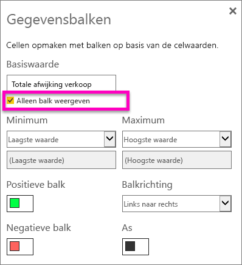
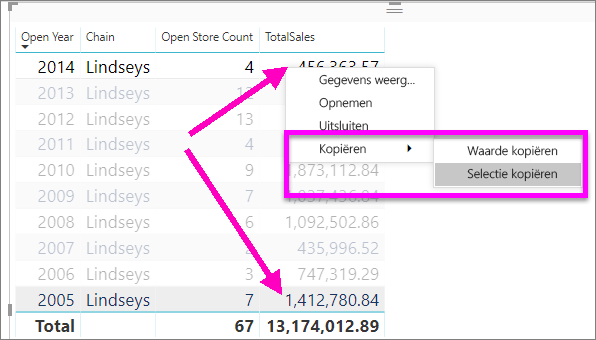

# Tabellen in Power BI-rapporten en -dashboards
Een tabel is een raster met gerelateerde gegevens in een logische reeks rijen en kolommen. Het kan ook koppen en een rij voor totalen bevatten. Tabellen werken goed met kwantitatieve vergelijkingen waarbij u veel waarden voor één categorie bekijkt. Deze tabel geeft bijvoorbeeld 5 verschillende eenheden  voor **Categorie** weer.

Maak tabellen in rapporten en markeer meerdere elementen kruislings in de tabel met andere visuals op dezelfde rapportpagina.  Bovendien kunt u rijen en kolommen selecteren, en zelfs afzonderlijke cellen en kruislings markeren. Afzonderlijke cellen en selecties van meerdere cellen kunnen worden gekopieerd en geplakt in andere toepassingen.

## Wanneer u een tabel gebruikt
Tabellen zijn een prima keuze:

* om gedetailleerde gegevens en exacte waarden (in plaats van visuele weergaven) te bekijken en vergelijken;
* om gegevens weer te gegeven in tabelvorm;
* om numerieke gegevens per categorie weer te geven.   

> [!NOTE]
> Als een tabel te veel waarden heeft, kunt u deze converteren naar een matrix en/of een detailweergave te gebruiken. Het maximum aantal weergegeven gegevenspunten in een tabel is 3500.

## Vereisten
- Power BI-service of Power BI Desktop
- Voorbeeld van een retailanalyse

## Een tabel maken
We maken de tabel hierboven om de omzet per artikelcategorie weer te geven. Meld u aan bij de Power BI-service als u de zelfstudie wilt volgen. Selecteer achtereenvolgens **Gegevens ophalen \> Voorbeelden \> Voorbeeld van een retailanalyse > Verbinding maken** en kies **Naar dashboard gaan**. Voor het maken van een visualisatie hebt u bewerkmachtigingen voor de gegevensset en het rapport nodig. De voorbeelden van Power Bi zijn allemaal bewerkbaar. Als het rapport met u is gedeeld, kunt u geen visualisaties maken in rapporten.

1. Selecteer in het navigatiedeelvenster aan de linkerkant **Werkruimten >Mijn werkruimte**.    
2. Selecteer het tabblad Gegevenssets en scrol omlaag naar de gegevensset Voorbeeld van een retailanalyse die u zojuist hebt toegevoegd.  Selecteer het prictogram **Rapport maken**.

    
2. Selecteer in de rapporteditor **Artikel** > **Categorie**.  Power BI maakt automatisch een tabel waarin alle categorieën worden weergegeven.

    
3. Selecteer **Verkoop > Gemiddelde eenheidsprijs** en **Verkoop > Omzet afgelopen jaar** en **Verkoop > Omzet van dit jaar** en kies alle 3 de opties (Waarde, Doel, Status).   
4. Zoek in het deelvenster Visualisaties het venster **Waarden** en sleep de waarden totdat de volgorde van de grafiekkolommen overeenkomt met de eerste afbeelding op deze pagina.  Het venster Waarden moet er als volgt uitzien.

    
5. Maak de tabel aan het dashboard vast door het speldpictogram te selecteren  

     

## De tabel opmaken
Er zijn veel manieren om een tabel op te maken. Hier komen er slechts enkele aan bod. Een uitstekende manier om de andere opmaakopties te ontdekken, is het deelvenster Opmaak te openen (verfroller pictogram ) en verschillende opties uit te proberen.

* Probeer het tabelraster op te maken. Hier hebben we een blauw verticaal raster toegevoegd, ruimte toegevoegd aan de rijen, de omlijning dikker gemaakt en de tekst groter gemaakt.

    

    
* We hebben de achtergrondkleur van de kolomkoppen gewijzigd, omlijning toegevoegd en het lettertype groter gemaakt. 

    

    

* U kunt zelfs opmaak toepassen op afzonderlijke kolommen en kolomkoppen. Breid om te beginnen **Veldopmaak** uit en selecteer vervolgens de op te maken kolom in de vervolgkeuzelijst. Afhankelijk van de kolomwaarden kunt u met Veldopmaak dingen instellen zoals weergave-eenheden, tekstkleur, aantal decimalen, achtergrond, uitlijning en meer. Nadat u de instellingen hebt aangepast, bepaalt u of u die instellingen zowel op de veldnamenrij als op de totalenrij toepast.

    

* Na een paar extra opmaakstappen, is dit het resultaat. Omdat er zoveel opmaakopties zijn, kunt u het beste beginnen met de standaardopmaak, het deelvenster Opmaak  openen en verschillende opties proberen. 

    

### Voorwaardelijke opmaak
Een bepaald type opmaak wordt aangeduid als *Voorwaardelijke opmaak*. Deze opmaak wordt toegepast op de velden in het venster **Waarden** van het deelvenster **Visualisaties** in de Power BI-service of in Power BI Desktop. 

Met voorwaardelijke opmaak voor tabellen kunt u aangepaste celachtergrondkleuren en kleuren voor lettertypen opgeven op basis van celwaarden, inclusief het gebruik van kleurovergangen. 

1. Selecteer in het deelvenster **Visualisaties** in de Power BI-service of in Power BI Desktop de pijl omlaag naast de waarde in het venster **Waarden** die u wilt opmaken (of klik met de rechtermuisknop op het veld). U kunt voorwaardelijke opmaak alleen beheren voor velden in het gebied **Waarden** van het venster **Velden**.

    
2. Selecteer **Achtergrondkleurschalen**. In het dialoogvenster dat wordt weergegeven, kunt u de kleur configureren, evenals de *minimum*- en *maximum*waarden. Als u het vak **Afwijken** selecteert, kunt u desgewenst ook een waarde voor *Centreren* configureren.

    

    Laten we wat aangepaste opmaak toepassen op de waarden voor Gemiddelde eenheidsprijs. Selecteer **Afwijken**, voeg wat kleuren toe en kies **OK**. 

    
3. Voeg een nieuw veld toe aan de tabel met positieve en negatieve waarden.  Selecteer **Verkoop > Afwijking van totale verkoop**. 

    
4. Voeg voorwaardelijke opmaak toe aan de gegevensbalk door de pijl omlaag te selecteren naast **Afwijking van totale verkoop** en **Voorwaardelijke opmaak > Gegevensbalken** te kiezen.

    
5. In het dialoogvenster dat wordt weergegeven stelt u kleuren in voor de **Positieve balk** en **Negatieve balk**, zet u een vinkje naast **Alleen balk weergeven** en brengt u eventuele andere gewenste wijzigingen aan.

    

    Wanneer u **OK** selecteert, vervangen gegevensbalken de numerieke waarden in de tabel, waardoor deze eenvoudiger te bekijken is.

    
6. Als u voorwaardelijke opmaak uit een visualisatie wilt verwijderen, klikt u eenvoudigweg opnieuw op het veld en selecteert u **Voorwaardelijke opmaak verwijderen**.

> [!TIP]
> Voorwaardelijke opmaak is ook beschikbaar in het deelvenster Opmaak (verfrollerpictogram). Selecteer de waarde die u wilt opmaken en stel vervolgens **Kleurschalen** of **Gegevensbalken** in op **Aan** om de standaardinstellingen toe te passen. Als u de instellingen wilt aanpassen, selecteert u **Geavanceerde besturingselementen**.
> 
## Waarden kopiëren uit Power BI-tabellen voor gebruik in andere toepassingen

Uw tabel of matrix bevat mogelijk inhoud die u wilt gebruiken in andere toepassingen, bijvoorbeeld Dynamics CRM, Excel of zelfs andere Power BI-rapporten. Met een rechtermuisklik in Power BI kopieert en plakt u een afzonderlijke cel of een selectie cellen naar uw klembord in de andere toepassing.

* Kopieer de waarde van een enkele cel, selecteer de cel, klik er met de rechtermuisknop op en kies **Waarde kopiëren**. Als u de onopgemaakte celwaarde naar uw klembord hebt gekopieerd, kunt u deze nu kopiëren in een andere toepassing.

    

* Als u meer dan een enkele cel wilt kopiëren, selecteert u een reeks cellen, of gebruikt u CTRL om één of meer cellen te selecteren. De kolomkoppen en rijkoppen zijn opgenomen in de kopie.

    

    De kolomkoppen en rijkoppen zijn opgenomen in de kopie.

    

## De kolombreedte van een tabel aanpassen
In Power BI wordt soms een kolomkop in een rapport en in een dashboard afgekapt. Houd de muis boven de ruimte aan de rechterkant van de kolomkop om de dubbele pijlen zichtbaar te maken. Selecteer deze en versleep ze om de volledige kolomnaam weer te geven.

## Aandachtspunten en probleemoplossing
* Wanneer u kolomopmaak toepast, kunt u slechts één uitlijningsoptie per kolom kiezen: Automatisch, Links, Centreren, Rechts. Doorgaans bevat een kolom alleen tekst of alleen getallen, en geen combinatie daarvan. Maar in het geval dat een kolom zowel getallen als tekst bevat, worden met de optie **Automatisch** teksten links uitgelijnd en getallen rechts. Dit gedrag ondersteund talen die van links naar rechts worden gelezen.   

## Volgende stappen

[Treemaps in Power BI](power-bi-visualization-treemaps.md)

[Visualization types in Power BI](power-bi-visualization-types-for-reports-and-q-and-a.md) (Typen visualisaties in Power BI)