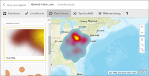
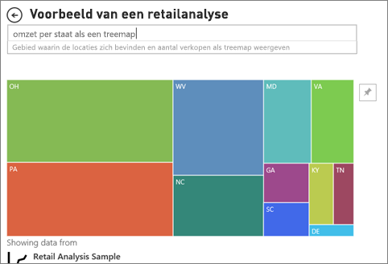

# Typen visualisaties in Power BI
## Visualisaties in Power BI
We zullen nieuwe visualisaties toevoegen. Kom snel terug!

En bekijk de [Microsoft AppSource](https://appsource.microsoft.com/marketplace/apps?product=power-bi-visuals) waar u een groeiende lijst vindt met [aangepaste visuals](../power-bi-custom-visuals.md) die u kunt downloaden en gebruiken in uw eigen dashboards en rapporten. Bent u in een creatieve bui? [Kijk dan hoe u uw eigen visuals maakt en toevoegt aan deze communitysite](../developer/office-store.md).  

## Lijst met visualisaties die beschikbaar zijn in Power BI
Al deze visualisaties kunnen worden toegevoegd aan Power BI-rapporten, opgegeven in Q&A en vastgemaakt aan dashboards.

### Vlakdiagrammen: eenvoudig (lagen) en gestapeld

>[!TIP]
>Het eenvoudige vlakdiagram is gebaseerd op het lijndiagram waarbij het gebied tussen de as en de lijn wordt gevuld.

Zie [Eenvoudig vlakdiagram](power-bi-visualization-basic-area-chart.md) voor meer informatie.

### Staaf- en kolomdiagrammen

 

>[!TIP]
>Staafdiagrammen zijn de standaard als u een specifieke waarde over verschillende categorieën wilt weergeven.

### Kaarten: meerdere rijen

### Kaarten: één getal

Zie [Een kaart maken (tegel met een groot getal)](power-bi-visualization-card.md) voor meer informatie.

### Combinatiegrafieken

>[!TIP]
>Een combinatiegrafiek combineert een kolomdiagram en een lijndiagram. Kies uit *Lijndiagram en gestapeld kolomdiagram* en *Lijndiagram en gegroepeerd kolomdiagram*.

Zie [Combinatiegrafieken in Power BI](power-bi-visualization-combo-chart.md) voor meer informatie.

### Ringdiagrammen

>[!TIP]
>Ringdiagrammen lijken op cirkeldiagrammen.  Ze geven het verband weer tussen delen en het geheel.

Zie [Ringdiagrammen in Power BI](power-bi-visualization-doughnut-charts.md) voor meer informatie.

### Trechterdiagrammen

>[!TIP]
>Trechters helpen bij het visualiseren van een proces dat bestaat uit fasen en waarbij items achter elkaar van de ene naar de volgende fase stromen.  Gebruik een trechter wanneer er een opeenvolgend verloop tussen fasen is, zoals een verkoopproces dat begint met potentiële klanten en eindigt met een verkoop.

Zie [Trechterdiagrammen in Power BI](power-bi-visualization-funnel-charts.md) voor meer informatie.

### Meterdiagrammen

>[!TIP]
>Geeft de huidige status weer in de context van een doel.

Zie [Meterdiagrammen in Power BI](power-bi-visualization-radial-gauge-charts.md) voor meer informatie.

### KPI's

>[!TIP]
>Geeft de voortgang naar een meetbaar doel aan.

Zie [KPI’s in Power BI](power-bi-visualization-kpi.md) voor meer informatie.

### Lijndiagrammen

>[!TIP]
>Benadrukken de algehele vorm van een volledige reeks waarden, meestal in de loop van de tijd.

### Kaarten: eenvoudige kaarten

>[!TIP]
>Worden gebruikt om categorische en kwantitatieve gegevens te koppelen aan ruimtelijke locaties.

Zie [Tips en trucs voor visuele kaarten](power-bi-map-tips-and-tricks.md) voor meer informatie.

### Kaarten: ArcGIS-kaarten

Zie [ArcGIS-kaarten in Power BI](../power-bi-visualization-arcgis.md) voor meer informatie.

### Maps: Choropletenkaarten

>[!TIP]
>Hoe intenser de kleur, hoe hoger de waarde.

Zie [Choropletenkaarten in Power BI](power-bi-visualization-filled-maps-choropleths.md) voor meer informatie.

### Kaarten: shape-kaarten

>[!TIP]
>Vergelijkt regio’s op kleur.

Zie [Shape-kaarten in Power BI](desktop-shape-map.md) voor meer informatie.

### Matrix

Zie [Matrix-visuals in Power BI](desktop-shape-map.md) voor meer informatie.

### Cirkeldiagrammen

### Spreidings- en bellendiagrammen

>[!TIP]
>Geven verbanden weer tussen twee (spreiding) of drie (bellen) kwantitatieve waarden (wel of niet, in welke volgorde enz.)

Zie [Spreidingsdiagrammen in Power BI](power-bi-visualization-scatter.md) voor meer informatie.

### High-densityspreiding

>[!TIP]
>Te veel gegevenspunten in een visual kunnen verwarrend zijn. Daarom wordt een geavanceerd densitysampling-algoritme gebruikt om te zorgen dat de visualisatie nauwkeurig is.

Zie [High-densityspreidingsdiagrammen in Power BI](desktop-high-density-scatter-charts.md) voor meer informatie.

### Slicers

Zie [Slicers in Power BI](power-bi-visualization-slicers.md) voor meer informatie.

### Zelfstandige afbeeldingen

Zie [Een afbeeldingswidget toevoegen aan een dashboard](../service-dashboard-add-widget.md) voor meer informatie.

### Tabellen

>[!TIP]
>Zijn zeer geschikt voor kwantitatieve vergelijkingen tussen items wanneer er veel categorieën zijn.

Zie [Werken met tabellen in Power BI](power-bi-visualization-tables.md) voor meer informatie.

### Treemaps

Zie [Treemaps in Power BI](power-bi-visualization-treemaps.md) voor meer informatie.

>[!TIP]
>Diagrammen van gekleurde rechthoeken waarbij de grootte de waarde aangeeft.  Ze kunnen hiërarchisch zijn waarbij kleinere rechthoeken zijn genest binnen de grootste rechthoeken.

### Watervalgrafieken

>[!TIP]
>Watervalgrafieken tonen een voorlopig totaal wanneer waarden worden toegevoegd of afgetrokken.

Zie [Watervalgrafieken in Power BI](power-bi-visualization-waterfall-charts.md) voor meer informatie.

## Aangeven welke visualisatie Q&A moet gebruiken
Wanneer u query's in natuurlijke taal typt met Power BI Q&A, kunt u het type visualisatie in uw query opgeven.  Bijvoorbeeld:

'***verkoop per staat als treemap***'

## Volgende stappen
[Visualisaties in Power BI-rapporten](power-bi-report-visualizations.md)    
[The right visual reference van sqlbi.com](http://www.sqlbi.com/wp-content/uploads/videotrainings/dashboarddesign/visuals-reference-may2017-A3.pdf)