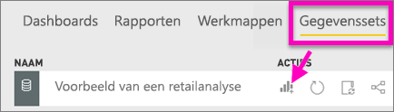
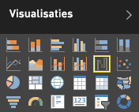
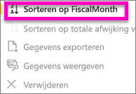
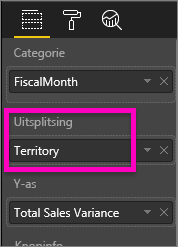
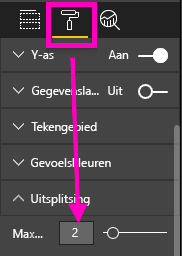

# Watervalgrafieken in Power BI
Een watervalgrafiek toont een voorlopig totaal terwijl waarden worden toegevoegd of afgetrokken. Dit is handig om te begrijpen hoe een beginwaarde (bijvoorbeeld netto inkomsten) wordt beïnvloed door een reeks positieve en negatieve wijzigingen.

De kolommen worden met een kleur gecodeerd, zodat u snel toenames en afnames kunt zien. De kolommen met de eerste en de uiteindelijke waarde beginnen vaak [op de horizontale as](https://support.office.com/article/Create-a-waterfall-chart-in-Office-2016-for-Windows-8de1ece4-ff21-4d37-acd7-546f5527f185#BKMK_Float "op de horizontale as"), terwijl de tussenliggende waarden zwevende kolommen zijn. Vanwege dit 'uiterlijk' worden watervalgrafieken ook wel bruggrafieken genoemd.

<iframe width="560" height="315" src="https://www.youtube.com/embed/qKRZPBnaUXM" frameborder="0" allow="autoplay; encrypted-media" allowfullscreen></iframe>

## Toepassingen voor een watervalgrafiek
In de volgende gevallen komen watervalgrafieken goed van pas:

* wanneer er wijzigingen voor de meting zijn binnen een tijdreeks of verschillende categorieën
* om de belangrijkste wijzigingen te controleren die bijdragen aan de totaalwaarde
* om de jaarlijkse winst van uw bedrijf uit te zetten door verschillende bronnen van omzet weer te geven en uiteindelijk bij de totale winst (of verlies) uit te komen.
* om het aantal personeelsleden aan het begin en het einde van een jaar in beeld te brengen
* om te visualiseren hoeveel geld u elke maand verdient en uitgeeft, en het huidige saldo voor uw rekening 

## Een watervalgrafiek maken
We gaan een watervalgrafiek maken waarin de verkoopvariantie (geschatte omzet ten opzichte van werkelijke omzet) per maand wordt aangegeven. Meld u aan bij Power BI als u mee wilt doen. Selecteer achtereenvolgens **Gegevens ophalen \> Voorbeelden \> Voorbeeld van een retailanalyse**. 

1. Selecteer het tabblad **Gegevenssets** en blader naar de nieuwe gegevensset Retail Analysis Sample.  Selecteer het pictogram **Rapport maken** om de gegevensset te openen in de rapportbewerkingsweergave. 
   
    
2. Selecteer in het deelvenster **Velden** **Sales \> Total Sales Variance**. Als **Total Sales Variance** zich niet in het gebied **Y-as** bevindt, sleept u het daarnaartoe.
3. Converteer de grafiek naar een **watervalgrafiek**. 
   
    
4. Selecteer **Time** \> **FiscalMonth** om dit veld toe te voegen aan de groep **Categorie**. 
   
    
5. Sorteer de watervalgrafiek in chronologische volgorde. Selecteer in de rechterbovenhoek het beletseltekens (...) en kies **Sorteren op FiscalMonth**.
   
    
   
    
6. Breid de grafiek iets uit om te zien welke staten per maand het meeste bijdragen aan de omzet. Sleep **Store** > **Territory** naar de groep **Uitsplitsing**.
   
    
7. Standaard worden de vijf staten weergegeven die het meeste bijdragen aan de toename of afname per maand. Op dit moment zijn we echter alleen geïnteresseerd in de twee belangrijkste staten.  Selecteer daarom **Uitsplitsing** in het deelvenster Indeling en zet **Maximaal aantal uitsplitsingen** op 2.
   
    
   
    We zien meteen dat de staten Ohio en Pennsylvania op dit moment de grootste bijdrage leveren aan de omzetvariantie, zowel negatief als positief, in onze watervalgrafiek. 
   
    
8. Dit is een interessant gegeven. Hebben Ohio en Pennsylvania zo'n grote invloed omdat de verkopen in deze twee staten veel hoger zijn dan in de andere staten?  Dat kunnen we uiteraard controleren. We maken een kaart waarop de verkoop per staat grafisch in beeld wordt gebracht.  
   
    
   
    Onze kaart ondersteunt onze theorie.  We zien dat deze twee staten zowel vorig jaar (belgrootte) als dit jaar (belarcering) het hoogste omzetcijfer hadden.

## Markeren en kruislings filteren
Zie [Een filter aan een rapport toevoegen](../power-bi-report-add-filter.md) voor meer informatie over het gebruik van het deelvenster Filters.

Wanneer u een kolom in een watervalgrafiek markeert, worden de andere visualisaties op de rapportpagina kruislings gefilterd en omgekeerd. De totaalkolom (Total) kan hiervoor overigens niet worden gebruikt.

## Volgende stappen
[Rapporten in Power BI](../consumer/end-user-reports.md)

[Visualization types in Power BI](power-bi-visualization-types-for-reports-and-q-and-a.md) (Typen visualisaties in Power BI)

[Visualisaties in Power BI-rapporten](power-bi-report-visualizations.md)

[Power BI - basisconcepten](../consumer/end-user-basic-concepts.md)

Hebt u nog vragen? [Misschien dat de Power BI-community het antwoord weet](http://community.powerbi.com/)

