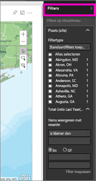
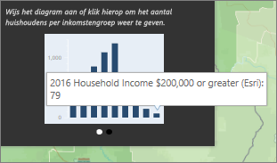
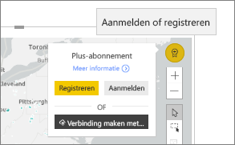

# Interactie met ArcGIS-kaarten in Power BI
Dit onderwerp is geschreven vanuit het oogpunt van een persoon die een ArcGIS-kaart *gebruikt* in de Power BI-service, in de desktopversie of op een mobiel apparaat. Zodra een maker een ArcGIS-kaart met u deelt, kunt u deze kaart op veel manieren gebruiken.  Zie [ArcGIS maps by esri tutorial](../visuals/power-bi-visualization-arcgis.md) (ArcGIS-kaarten van Esri - een zelfstudie) voor meer informatie over het maken van een ArcGIS-kaart.

De combinatie van ArcGIS-kaarten en Power BI tilt kaarten naar een volledig nieuw niveau, verder dan de presentatie van punten op een kaart. Met de beschikbare opties voor basiskaarten, locatietypen, thema's, symboolstijlen en referentielagen worden prachtige informatieve kaartvisualisaties gemaakt. De combinatie van bindende gegevenslagen (zoals censusgegevens) op een kaart met ruimtelijke analyse geeft een beter inzicht in uw visualisatiegegevens.

> [!TIP]
> GIS staat voor Geographic Information System (geografische informatiesysteem).
> 

In het gebruikte voorbeeld wordt gekeken naar de omzet van vorig jaar per stad, en gebruikgemaakt van een basisstratenkaart, bellensymbolen om de grootte weer te geven, en een referentielaag voor het gemiddelde inkomen per huishouden. De kaart bevat 3 spelden en één radius voor de reistijd (in paars).

> [!TIP]
> Ga naar [esri's page on Power BI](https://www.esri.com/powerbi) (Esri-pagina in Power BI) om veel voorbeelden en aanbevelingen te bekijken. Ga vervolgens naar [ArcGIS Maps for Power BI Getting Started page](https://doc.arcgis.com/en/maps-for-powerbi/get-started/about-maps-for-power-bi.htm) (Pagina Aan de slag voor ArcGIS Maps for Power BI).
> 
> 

 

## Toestemming van de gebruiker
De eerste keer dat een collega een ArcGIS-kaart met u deelt, wordt in Power BI een prompt weergegeven. ArcGIS MAPS for Power BI wordt geleverd door Esri (www.esri.com) en uw gebruik van ArcGIS Maps for Power BI is onderhevig aan de voorwaarden en het privacybeleid van Esri. Power BI-gebruikers die de visuals van ArcGIS Maps for Power BI willen gebruiken, moeten hiermee akkoord gaan in het toestemmingsdialoogvenster.

## Selectiehulpprogramma’s
ArcGIS Maps for Power BI biedt drie selectiemodi. Er kunnen maximaal 250 gegevenspunten tegelijk worden geselecteerd.

: hiermee worden afzonderlijke gegevenspunten geselecteerd.

: hiermee wordt een rechthoek op de kaart getekend en worden de opgenomen gegevenspunten geselecteerd. CTRL gebruiken om meer dan één rechthoekig gebied te selecteren.

: hiermee wordt toegestaan dat grenzen of polygonen binnen referentielagen worden gebruikt voor het selecteren van opgenomen gegevenspunten.

 

## Interactie met een ArcGIS-kaart
De functies die beschikbaar zijn voor u, zijn afhankelijk van het feit of u de *maker* (persoon die de kaart heeft gemaakt) of de *consument* (iemand met wie een ArcGIS-kaart is gedeeld) bent. Als u als consument gebruikmaakt van een ArcGIS-kaart (ook wel de [Leesweergave](../consumer/end-user-reading-view.md) genoemd), zijn dit de beschikbare acties.

* Als u een Premium-gebruiker bent met *weergavemachtigingen*, kunt u [de gegevens bekijken die zijn gebruikt om de visualisatie te maken](../consumer/end-user-show-data.md), [u abonneren](../consumer/end-user-subscribe.md), de kaart bekijken in [de modus Focus en Volledig scherm](../consumer/end-user-focus.md), [gerelateerde inhoud bekijken](../consumer/end-user-related.md), [de filters gebruiken](../consumer/end-user-report-filter.md) die zijn ingesteld door de *maker van het rapport*, [het rapport delen](../service-share-reports.md) en meer.

* Net als bij andere typen visualisaties kunnen gebruikers van Power BI **Pro** alles doen wat een Premium-gebruiker ook kan, plus [de onderliggende gegevens exporteren](../visuals/power-bi-visualization-export-data.md), [metrische gegevens over het gebruik ophalen](../service-usage-metrics.md), een kopie opslaan, [publiceren op internet](../service-publish-to-web.md) en meer.

    
* Vouw het deelvenster **Filters** uit om de kaart te verkennen met behulp van filters.   
      
* Als de kaart een referentielaag heeft, selecteert u locaties om details in een tooltip weer te geven. Hier hebben we Adams County geselecteerd en zien we gegevens uit de referentielaag voor het gemiddelde inkomen per huishouden die de maker heeft toegevoegd aan de kaart.
  
      
  
    In dit geval zien we ook een diagram. Selecteer een balk in het diagram om u te verdiepen in de gegevens. U ziet hier dat 79 huishoudens in Adams county een inkomen hadden van $ 200.000 of hoger.
  
    
  
    Selecteer de pijl om eventuele extra diagrammen weer te geven.
* Beweeg de muisaanwijzer over de locatiesymbolen in de basiskaart om de details in een tooltip weer te geven.     
  
  
  > [!TIP]
  > U moet mogelijk inzoomen om een specifieke locatie te selecteren.  Anders worden er mogelijk meerdere tooltips tegelijkertijd weergegeven in Power BI wanneer er overlappende locaties zijn. Selecteer de pijlen om te schakelen tussen de tooltips
  > 
  > 
  > 
  > 
* Als de maken een Infographics-laag heeft toegevoegd aan de ArcGIS-kaart, worden in de rechterbovenhoek van de kaart extra gegevens weergegeven.  Hier heeft de maker van de kaart bijvoorbeeld 'Kinderen onder de 14' toegevoegd.
  
    

## Overwegingen en beperkingen
ArcGIS Maps for Power BI is beschikbaar in de volgende services en toepassingen:

<table>
<tr><th>Service/app</th><th>Beschikbaarheid</th></tr>
<tr>
<td>Power BI Desktop</td>
<td>Ja</td>
</tr>
<tr>
<td>Power BI-service (app.powerbi.com)</td>
<td>Ja</td>
</tr>
<tr>
<td>Mobiele Power BI-toepassingen</td>
<td>Ja</td>
</tr>
<tr>
<td>Power BI publiceren op internet</td>
<td>Nee</td>
</tr>
<tr>
<td>Power BI Embedded</td>
<td>Nee</td>
</tr>
<tr>
<td>Power BI-service insluiten (PowerBI.com)</td>
<td>Nee</td>
</tr>
</table>

**Hoe werken ArcGIS Maps en Power BI samen?**
ArcGIS Maps for Power BI wordt geleverd door Esri (www.esri.com). Uw gebruik van ArcGIS Maps for Power BI is onderhevig aan de [voorwaarden](https://go.microsoft.com/fwlink/?LinkID=8263222) en het [privacybeleid](https://go.microsoft.com/fwlink/?LinkID=826323) van Esri. Power BI-gebruikers die de visuals van ArcGIS Maps for Power BI willen gebruiken, moeten hiermee akkoord gaan in het toestemmingsdialoogvenster (raadpleeg Toestemming van gebruiker voor meer informatie).  Het gebruik van ArcGIS Maps for Power BI van Esri is onderhevig aan de voorwaarden en het privacybeleid van Esri. Een koppeling naar de voorwaarden en het privacybeleid vindt u in het toestemmingsdialoogvenster. Elke gebruiker moet toestemming geven voor het eerste gebruik van ArcGIS Maps for Power BI. Zodra de gebruiker toestemming heeft gegeven, worden de aan de visual gekoppelde gegevens naar de services van Esri verzonden voor (ten minste) geocodering, wat betekent dat de locatiegegevens worden getransformeerd in breedtegraad- en lengtegraadgegevens die in een kaart kunnen worden weergegeven. U moet ervan uitgaan dat alle gegevens die aan de gegevensvisualisatie zijn gekoppeld, naar de services van Esri kunnen worden verzonden. Esri biedt services zoals basiskaarten, analyses van ruimtelijke gegevens, geocodering, enzovoort. Voor de samenwerking tussen de visuals van ArcGIS Maps for Power BI en deze services wordt gebruikgemaakt van een SSL-verbinding. Deze verbinding wordt beveiligd met een certificaat dat door Esri wordt verstrekt en onderhouden. Meer informatie over ArcGIS Maps for Power BI vindt u op de [productpagina voor ArcGIS Maps for Power BI](https://www.esri.com/powerbi) van Esri.

**Power BI Plus**    

Wanneer een gebruiker zich via ArcGIS Maps for Power BI voor een Plus-abonnement van Esri registreert, gaat de gebruiker een directe relatie met Esri aan. Power BI verzendt geen persoonlijke gegevens over de gebruiker naar Esri. De gebruiker meldt zich aan bij en vertrouwt een door Esri verstrekte AAD-toepassing waarbij gebruik wordt gemaakt van de eigen AAD-identiteit van de gebruiker. Op deze manier deelt de gebruiker zijn of haar persoonlijke gegevens rechtstreeks met Esri. Zodra de gebruiker Plus-inhoud aan een visual van ArcGIS Maps for Power BI toevoegt, hebben andere Power BI-gebruikers ook een Plus-abonnement van Esri nodig als zij die inhoud willen weergeven of bewerken. 

Voor gedetailleerde technische vragen over de werking van ArcGIS Maps for Power BI van Esri kunt u contact opnemen met Esri via hun ondersteuningssite.

**De ArcGIS-kaart wordt niet weergegeven**    
In services of toepassingen waarin ArcGIS Maps for Power BI niet beschikbaar is, wordt de visualisatie weergegeven als een lege visual met het logo van Power BI.

**Ik zie niet al mijn informatie op de kaart**    
Wanneer u op de kaart de breedtegraad/lengtegraad geocodeert, worden er tot 30.000 gegevenspunten weergegeven. Wanneer u gegevenspunten zoals postcodes of adressen geocodeert, worden alleen de eerste 15.000 gegevenspunten gegeocodeerd. Het geocoderen van plaatsnamen en landen is niet onderhevig aan de adreslimiet van 1500.

**Zijn er kosten verbonden aan het gebruik van ArcGIS Maps for Power BI?**

ArcGIS Maps for Power BI is beschikbaar voor alle Power BI-gebruikers zonder extra kosten. Het is een onderdeel dat wordt geleverd door **Esri**, en uw gebruik is onderhevig aan de voorwaarden en het privacybeleid van **Esri**, zoals eerder in dit artikel is aangegeven. Als u zich abonneert op ArcGIS **Plus**, worden er kosten in rekening gebracht.

**Ik krijg een foutbericht dat mijn cache vol is**

Dit is een bekende bug. Er wordt aan een oplossing gewerkt.  Selecteer in de tussentijd de koppeling die wordt weergegeven in het foutbericht, voor instructies over het wissen van de Power BI-cache.

**Kan ik mijn ArcGIS-kaarten offline bekijken?**

Nee, Power BI moet zijn verbonden met het netwerk om kaarten weer te geven.

## Volgende stappen
Hulp krijgen: **Esri** biedt [uitgebreide documentatie](https://go.microsoft.com/fwlink/?LinkID=828772) voor de functies van **ArcGIS Maps for Power BI**.

U kunt vragen stellen, de meest recente informatie vinden, problemen melden en antwoorden vinden in de Power BI-[communitythread met betrekking tot **ArcGIS Maps for Power BI**](https://go.microsoft.com/fwlink/?LinkID=828771).

[Productpagina van ArcGIS Maps for Power BI](https://www.esri.com/powerbi)
