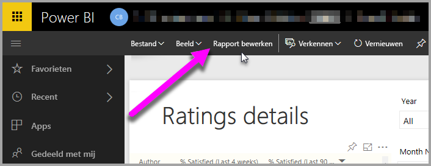
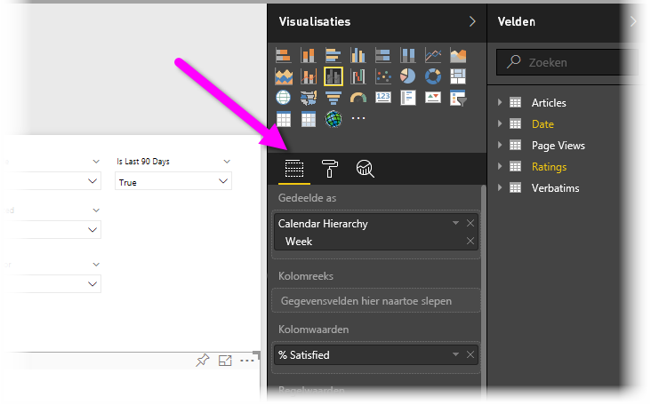
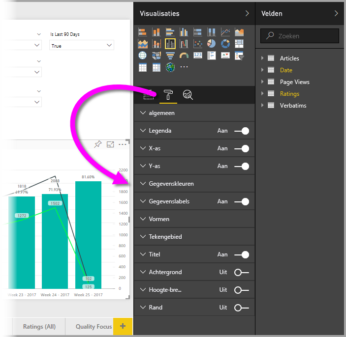
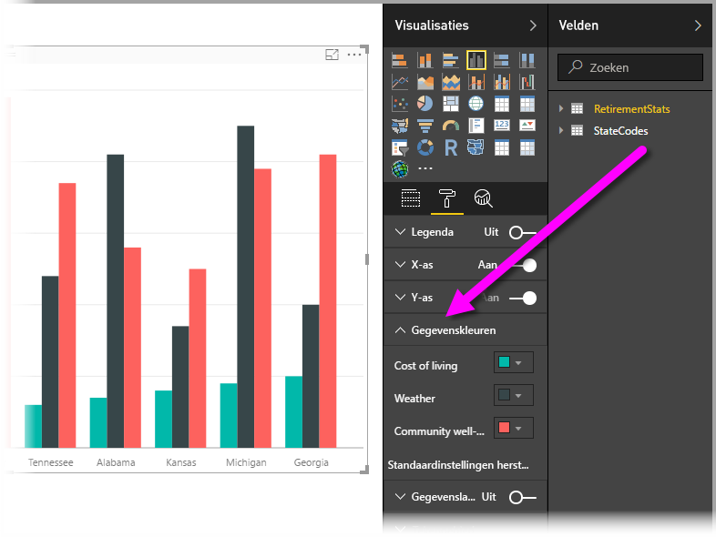
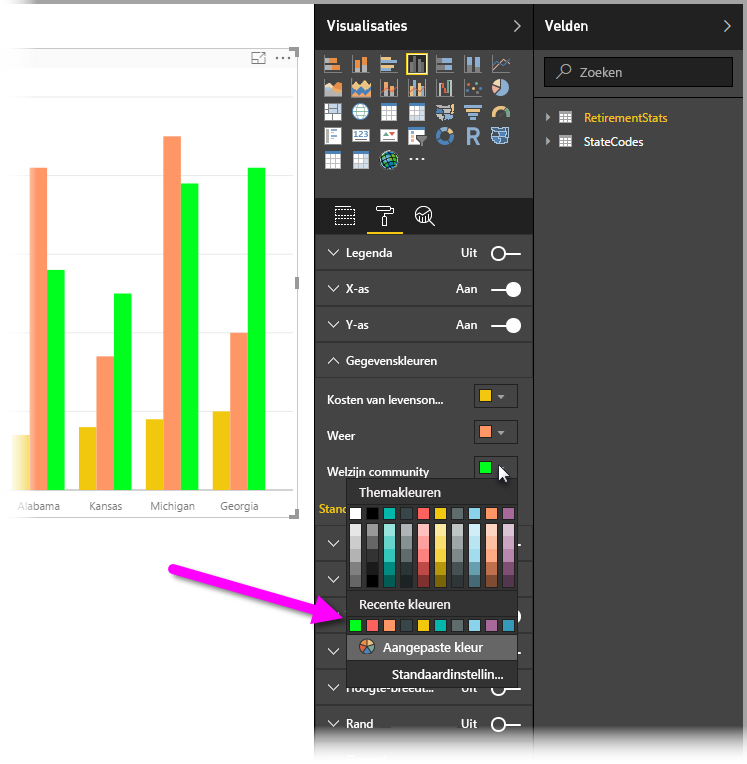
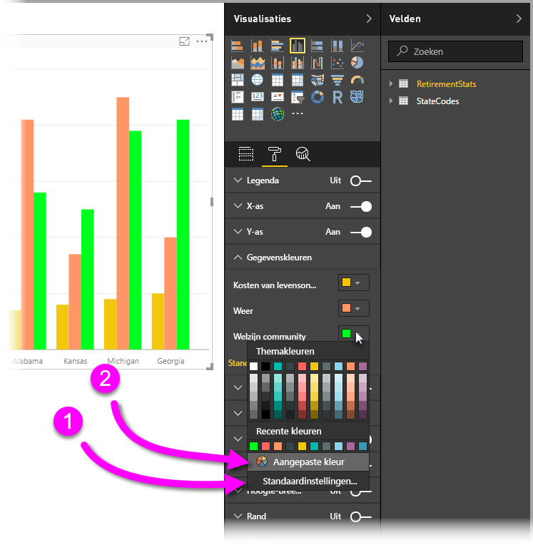
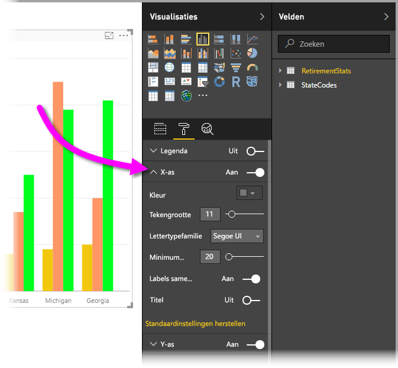

# Aan de slag met kleuropmaak en aseigenschappen
In **Power BI** kunt u de kleur wijzigen van gegevensreeksen, gegevenspunten en zelfs van de achtergrond van visualisaties. U kunt ook de weergave van de x-as en y-as bepalen, zodat dat u volledige controle hebt over de manier waarop uw dashboards en rapporten worden weergegeven.

Selecteer om te beginnen een **rapport** in het deelvenster **Mijn werkruimte**. Selecteer vervolgens in het bovenste menu **Rapport bewerken**.  

Wanneer u een rapport hebt geopend voor bewerken en u een visualisatie selecteert, ziet u aan de rechterkant het deelvenster **Visualisaties**. Hier kunt u visualisaties toevoegen of wijzigen. Direct onder de beschikbare visualisaties staan drie pictogrammen: het pictogram **Velden** (een stapel balken), het pictogram **Indeling** (een verfroller) en het pictogram **Analyse** (een vergrootglas). In de onderstaande afbeelding is het pictogram **Velden** geselecteerd, wat u kunt zien aan gele balk onder het pictogram.

Wanneer u **Indeling** selecteert, worden onder het pictogram de opties weergegeven die beschikbaar zijn om de kleur en assen voor de momenteel geselecteerde visualisatie te wijzigen.  

U kunt voor elke visualisatie allerlei elementen aanpassen:

* Legenda
* X-as
* Y-as
* Gegevenskleuren
* Gegevenslabels
* Vormen
* Tekengebied
* Titel
* Achtergrond
* Hoogte-breedteverhouding vergrendelen
* Rand

> [!NOTE]
>  
> Deze elementen zijn niet voor elk type visualisatie beschikbaar. De visualisatie die u selecteert, is van invloed op de aanpassingen die beschikbaar zijn. Zo ziet u bijvoorbeeld niet de aanpassing X-as als u een cirkeldiagram hebt geselecteerd, omdat een cirkeldiagram helemaal geen x-as heeft.

Als u geen enkele visualisatie hebt geselecteerd, wordt **Filters** weergegeven in plaats van de pictogrammen en kunt u filters toepassen op alle visualisaties op de pagina.

Laten we eens een paar voorbeelden bekijken: een voorbeeld met kleuren en in het andere voorbeeld gaan we de eigenschappen van een as wijzigen. Als we deze voorbeelden hebben doorgenomen, weet u genoeg om voortaan zelf kleuren, assen en labels aan te passen.

## Werken met kleuren

We gaan stapsgewijs de procedure doornemen voor het aanpassen van kleuren in een grafiek.

1. Ik selecteer **Gegroepeerd kolomdiagram** vanaf het rapportcanvas.
2. Vervolgens kies ik het pictogram **Indeling** om de beschikbare aanpassingen weer te geven.
3. Ik selecteer de kleine pijl-omlaag links van de aanpassing **Gegevenskleuren**. We zien nu de opties die specifiek zijn voor de visualisatie die ik heb geselecteerd.
4. De optie **Gegevenskleuren** klapt naar beneden uit om de beschikbare aanpassingen te laten zien.  
   

We gaan wat dingen aanpassen. Ik kan de pijl-omlaag naast de kleur selecteren om wijzigingen aan te brengen in elke beschikbare gegevensreeks. Ik maak **Cost of living** geel, **Weather** oranje en **Community well-being** groen. In het volgende scherm ziet u de laatste stap, waarin ik de kleur van **Cost of living** wijzig.  

De nieuwe kleuren kunt u bekijken in de onderstaande afbeelding. Dit is wel een hele opvallende grafiek. Hier volgen enkele handige opmerkingen over het werken met kleuren. De nummers in de volgende lijst vindt u terug in het onderstaande scherm, zodat u snel kunt zien waar u deze nuttig elementen kunt vinden of wijzigen.

1. Niet tevreden over de kleuren? Geen probleem. Selecteer **Standaardinstelling herstellen** om alle standaardkleuren te herstellen. Dit kunt u voor één kleur doen of voor de hele visualisatie.
2. Zoekt u een kleur die niet in het palet staat? Selecteer **Aangepaste kleur** en u kunt kiezen uit het hele kleurenspectrum.  
   

Valt het toch tegen? Ook hier kunt u op **Ctrl+Z** drukken om de bewerking ongedaan te maken.

## Aseigenschappen wijzigen

Vaak is het handig om de x-as of de y-as te wijzigen. Net als bij het werken met kleuren, kunt u een as wijzigen door de pijl-omlaag links van de as te selecteren die u wijzigen, zoals wordt weergegeven in de volgende afbeelding.  

Als u de opties voor de **x-as** wilt samenvouwen, selecteert u de pijl-omhoog naast **X-as**.

U kunt de labels voor de x-as helemaal verwijderen door het keuzerondje naast **X-as** op Uit te zetten. U kunt de weergave van assen ook in- of uitschakelen met het keuzerondje naast **Titel**.  

Er zijn allerlei soorten kleuren waaruit u kunt kiezen en nog veel meer aanpassingen die u kunt toepassen op uw Power BI-rapporten en -dashboards.

> [!NOTE]
>  
> De aanpassingen die beschikbaar zijn wanneer u het pictogram **Indeling** selecteert, zijn trouwens ook beschikbaar in Power BI Desktop.

## Kleur instellen uit tekstwaarden

Vanaf de update van **Power BI Desktop** van augustus 2018 kunt u voor een bepaald rapportelement kleuren instellen via de tekstwaarde of hex-code. Zie [Voorwaardelijke opmaak in tabellen](../desktop-conditional-table-formatting.md) voor meer informatie.

## Volgende stappen
Raadpleeg voor meer informatie hete volgende artikel:  

* [Tips en trucs voor het gebruik van opmaak in Power BI](service-tips-and-tricks-for-color-formatting.md)  
* [Voorwaardelijke opmaak in tabellen](../desktop-conditional-table-formatting.md)

